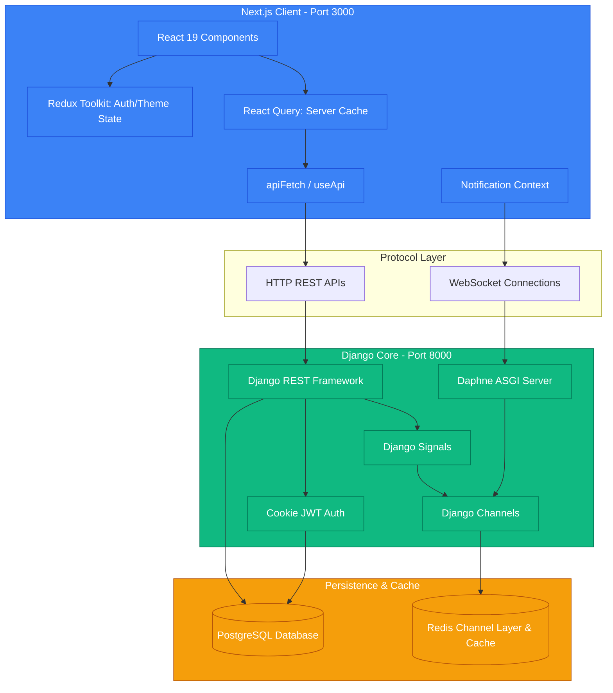

# Alqaiser - Business Operating System (BOS)
## Technical Architecture, System Flow, and Onboarding Documentation

Alqaiser is a comprehensive, multi-tenant Business Operating System (ERP) designed to manage HR, Inventory, Finance, and AI-driven monitoring. It is built using a modern full-stack architecture featuring a Django backend and a Next.js frontend, orchestrated via Docker and real-time WebSocket synchronizations.

---

## 🏛 High-Level System Architecture

Alqaiser is designed as a modular monolithic hybrid system. The backend handles REST API requests, database persistence, and WebSocket push connections, while the frontend is a highly interactive Single Page Application (SPA) structured with Next.js App Router.



### Module Responsibilities
- **Frontend App Router:** Manages routing and separates the public `/login` route from private pages inside the `(app)` route group.
- **Redux Toolkit:** Manages core client-side state (User profile authentication and light/dark theme settings).
- **React Query:** Manages all server-state caching, automatic background fetching, and page-level query sync.
- **Django REST Framework (DRF):** Serves highly standardized JSON REST endpoints using custom base authenticators and multi-tenant mixins.
- **Django Channels (Daphne):** Manages asynchronous WebSocket connections scoped by company and branch identifiers.
- **Redis:** Serves as the real-time Channel Layer for message distribution and as a dedicated cache for high-frequency operations.

---

## 📂 Project Directory Structure

### 1. Backend (`/backend`)
The backend is structured around modular applications residing within the `apps/` directory:
- **`config/`**: Core project configuration including ASGI routing, global setting configurations, URLs, and database configurations.
- **`apps/common/`**: Contains custom abstract base models (`BaseModel`), custom JWT cookie authentication middleware (`CookieJWTAuthentication`), query mixins, and request tracking.
- **`apps/accounts/`**: Handles login authentication, token refresh, and user profile retrieval.
- **`apps/organization/`**: Manages the structural backbone: `Company`, `Branch`, `User` models, current context tracking (`UserCompanyContext`), and role-based permissions (`RolePermission`).
- **`apps/compsetting/`**: Manages company-specific operational parameters, including working hours, holidays, work schedules, and configuration change histories.
- **`apps/hr/`**: Coordinates full employee workflows, leave balances, rosters, exit procedures, asset allocations, recruitment, and payroll processing.
- **`apps/inventory/`**: Manages products, stock levels, sales orders, purchase receipts, warehouses, barcodes, and partner (Suppliers/Vendors) details.
- **`apps/notifications/`**: Manages physical WebSocket channels, consumers, session/token decoders, and real-time DB logging.
- **`apps/finance/`** *(Skeleton)*: Scaffolded folders with empty files for future expansion.
- **`apps/monitoring/`** *(Skeleton)*: Scaffolded folder for future AI activity-tracking integrations.

### 2. Frontend (`/frontend`)
The Next.js 16 app utilizes a clean, feature-driven, modern directory structure:
- **`src/app/`**: App Router roots. Authenticated views reside in `src/app/(app)/` and public views in `src/app/login/`.
- **`src/store/`**: Central Redux Toolkit state stores and slices (`authSlice.ts`, `themeSlice.ts`).
- **`src/services/`**: Abstractions for logical features:
  - `companyContextService.js`: Intercepts client-side context shifts.
  - `permissionService.js`: Evaluates fine-grained RBAC actions.
  - `taxEngine.js`: Computes exclusive taxes (VAT/Sales Tax) for commercial transactions.
  - `leaveEngine.js`: Evaluates leave balances, probation dates, and working days.
- **`src/hooks/`**: Custom data fetching hooks utilizing TanStack Query wrappers matching specific APIs (e.g. `useEmployees`, `useSalesOrder`).
- **`src/lib/`**: Common libraries:
  - `api.ts`: Dedicated network fetch wrapper (`apiFetch`) providing automatic toast feedback and cookie binding.
  - `notifications.ts`: Controls browser Service Workers and local OS push notifications.

---

## 🔒 Multi-Tenancy & Data Isolation

Alqaiser enforces strict multi-tenant isolation at both the database level and the API level.

### 1. Abstract BaseModel (`apps/common/basemodel.py`)
All core models inherit from `BaseModel`, which injects:
- `id`: Primary key auto-increment BigInt.
- `_id`: Universally unique identifier (UUIDv4) exposed publicly to avoid raw ID exposure.
- `company_id`: Strict integer reference to the user's current company.
- `branch_id`: Strict integer reference to the user's current branch.
- `is_deleted`: Soft-delete flag (with audit fields `created_by`, `updated_by`, `deleted_by`).
- Composite database index: `['company_id', 'branch_id']`.

### 2. CompanyBranchMixin (`apps/common/baseauthentication.py`)
To prevent data leakage, DRF views apply `CompanyBranchMixin`. It automatically overrides `get_queryset()` to enforce:
1. **Company Isolation:** Restricts querysets strictly to the user's active `company_id`. If `company_id` is missing, an empty queryset is returned.
2. **Branch Isolation:** Evaluates the user's role. If the user is a `COMPANY_ADMIN`, they bypass branch isolation. Otherwise, they are locked into the specific `branch_id` they belong to.
3. **Soft Delete Filter:** Intercepts the request and filters out any records where `is_deleted=True` automatically.

```python
# Multi-tenant execution in views
class ProductViewSet(CompanyBranchMixin, viewsets.ModelViewSet):
    queryset = Product.objects.all()
    serializer_class = ProductSerializer
    # Mixin automatically enforces: company isolation, branch isolation, and soft delete safety
```

---

## 🔑 Authentication & Token Lifecycle

Alqaiser relies on a secure **HttpOnly Cookie-based SimpleJWT Flow** to completely shield tokens from XSS (Cross-Site Scripting) vectors.

```
[ Client Browser ]                      [ useApi Hook ]                     [ Accounts API ]
        │                                      │                                    │
        │─── Submit Credentials ──────────────>│─── POST /api/accounts/login/ ─────>│
        │                                      │                                    │
        │                                      │<── Set HttpOnly access_cookie ─────│
        │                                      │    Set HttpOnly refresh_cookie ────│
        │                                      │                                    │
        │<── Set Redux Auth State ─────────────│                                    │
        │                                      │                                    │
        │─── Make Authorized Request ─────────>│─── Request with Cookies ──────────>│
        │                                      │                                    │
        │                                      │<── 401 Unauthorized (Expired) ─────│
        │                                      │                                    │
        │                                      │─── POST /token/refresh/ ──────────>│
        │                                      │    (Sends refresh_token cookie)    │
        │                                      │                                    │
        │                                      │<── Set New access_cookie ──────────│
        │                                      │                                    │
        │                                      │─── Retry Original Request ────────>│
```

### Step-by-Step Flow:
1. **Login Request:** The user submits a username/email and password to `/api/accounts/login/`.
2. **Token Issuance:** The backend validates credentials and issues a SimpleJWT token pair.
3. **Cookie Binding:** The cookies `access_token` and `refresh_token` are set via `response.set_cookie` with settings:
   - `httponly=True` (Restricts Javascript read access).
   - `secure=True` (Only sent over HTTPS, enabled in production when `DEBUG=False`).
   - `samesite='Lax'` (Protects against CSRF).
   - `path='/'`.
4. **API Requests (`apiFetch`):** The frontend wrapper `apiFetch` uses `credentials: "include"`, instructing the browser to automatically include the `access_token` cookie on all API requests.
5. **Silent Token Refresh (`useApi.ts`):** 
   - When an API call fails with a `401 Unauthorized` status, the `useApi` interceptor catches the error.
   - It stalls outgoing requests and issues a single shared refresh promise to `/api/accounts/token/refresh/`.
   - The browser automatically attaches the `refresh_token` HttpOnly cookie.
   - The backend validates the refresh cookie and issues a fresh `access_token` cookie.
   - The frontend retries the failed API call seamlessly. If the refresh request itself fails, the user is logged out and redirected to `/login`.

---

## 🔄 Real-time Sync & Cache Invalidation

Alqaiser connects database modifications in Django to real-time UI invalidation in Next.js using an event-driven loop.

```
 [ Database Event ]            [ Django Signals ]           [ WebSocket Group ]          [ React Query ]
         │                              │                            │                           │
  Model.save() completed                │                            │                           │
         │─────────────────────────────>│                            │                           │
         │                              │─── transaction.on_commit ─>│                           │
         │                              │    (broadcast_data_update) │                           │
         │                              │                            │─── Send "data_update" ───>│
         │                              │                            │    {entity, record_id}    │
         │                              │                            │                           │
         │                              │                            │                           │─── Invalidate Query
         │                              │                            │                           │    (Forces UI Fetch)
```

### 1. The Trigger: Django Signals (`apps/inventory/signals.py`, `apps/hr/signals.py`)
When a model (such as `SalesOrder` or `Employee`) is created, updated, or deleted, a `post_save` or `post_delete` signal captures the change.
To prevent race conditions where the WebSocket message arrives before the database transaction actually commits, all broadcasts are deferred:
```python
transaction.on_commit(lambda: broadcast_data_update(company_id, branch_id, 'sales_order', 'update', instance.id))
```

### 2. The Broadcast Channel (`apps/notifications/consumers.py`)
The signal utility pushes the event payload through the Django Channels Redis channel layer. Daphne routes this to the active WebSocket group:
- Group Name: `notify_c{company_id}_b{branch_id}`
- Message Type: `data_update`
- Body: `{"type": "data_update", "entity": "sales_order", "action": "update", "record_id": "<uuid>"}`

### 3. The Front-end Receiver & Invalidation (`contexts/NotificationContext.tsx`)
The frontend is persistently connected to the WebSocket. When it receives a `data_update` message:
1. It references a static mapping `ENTITY_TO_QUERY_KEY`:
   ```typescript
   const ENTITY_TO_QUERY_KEY = {
     sales_order: ["salesOrders"],
     product: ["products", "productStats"],
     leaves: ["leaves", "leaveStats", "leaveBalances"]
   }
   ```
2. It calls TanStack Query's invalidator:
   ```typescript
   queryClient.invalidateQueries({ queryKey: [key] });
   ```
3. This marks the cache as stale, triggering an immediate background fetch for active components, keeping the interface up to date without manual page reloads.

---

## 📊 Database Schema Overview

```
                      ┌───────────────────────┐
                      │        Company        │
                      └───────────────────────┘
                                  │ 1
                                  │
                                  │ *
                      ┌───────────────────────┐
                      │        Branch         │
                      └───────────────────────┘
                                  │ 1
                                  │
                                  │ *
  ┌───────────────────────┬───────┴───────┬───────────────────────┐
  │                       │               │                       │
  ▼ *                     ▼ *             ▼ *                     ▼ *
┌───────────────────┐   ┌───────────┐   ┌───────────────────┐   ┌───────────────────┐
│       User        │   │  Product  │   │    SalesOrder     │   │  CompanySettings  │
└───────────────────┘   └───────────┘   └───────────────────┘   └───────────────────┘
  │ 1                     │ 1             │ 1                     │ 1
  │                       │               │                       │
  │ 1                     │ *             │ *                     │ *
┌───────────────────┐   ┌───────────┐   ┌───────────────────┐   ┌───────────────────┐
│ UserCompContext   │   │  Variant  │   │  SalesOrderLine   │   │    WorkingDay     │
└───────────────────┘   └───────────┘   └───────────────────┘   └───────────────────┘
                          │ 1
                          │
                          │ *
                        ┌───────────┐
                        │ StockItem │
                        └───────────┘
                          │ *
                          │
                          │ 1
                        ┌───────────┐
                        │ Warehouse │
                        └───────────┘
```

### Core Entities & Relationships

#### 1. Organization Layer
- **`Company`**: The primary tenant boundary. Contains operational configurations and the soft-delete indicator `is_deleted`.
- **`Branch`**: Relates to `Company` (Many-to-One). Defines the physical division, currency conventions, and local branch tax settings.
- **`User`** *(Custom Auth Model)*: Relates to `Company` and `Branch` (Nullable). Injects roles (e.g. `COMPANY_ADMIN`, `STAFF`) and standard Django authentication flags.
- **`UserCompanyContext`**: Relates to `User` (One-to-One). Keeps track of the active `current_company` and `current_branch` when switching contexts.

#### 2. Settings & Permissions
- **`CompanySettings`**: Relates to `Company` (One-to-One). Controls operating time limits, standard shifts, regional tax rates, and leave policies.
- **`WorkingDay`**: Relates to `CompanySettings` (Many-to-One). Determines active operating days of the week.
- **`RolePermission`**: Maps actions (`can_view`, `can_create`, `can_update`, `can_delete`) to system modules and roles.

#### 3. Commercial Inventory Layer
- **`Product`**: Relates to `Category` and `Brand` (Many-to-One). Stores product units, descriptions, and tax rates.
- **`ProductVariant`**: Relates to `Product` (Many-to-One). Represents the physical stock keeping unit (SKU) with variant properties.
- **`StockItem`**: Relates to `ProductVariant` and `Warehouse` (Many-to-One). Enforces a unique composite key constraint `['variant', 'warehouse']` and tracks stock quantities.
- **`SalesOrder`**: Relates to `Customer` and `Warehouse` (Many-to-One). Manages commercial order lifecycle phases (`PENDING`, `DRAFT`, `COMPLETE`, `CANCELLED`).
- **`SalesOrderLine`**: Relates to `SalesOrder` (Many-to-One) and `ProductVariant` (Many-to-One). Stores order item breakdowns, prices, and discounts.

---

## 🛠 High-Level API Endpoints

### 1. Accounts & Sessions
| Method | Endpoint | Description | Auth Required |
| :--- | :--- | :--- | :--- |
| `POST` | `/api/accounts/login/` | Authenticate user, issue JWTs inside HttpOnly cookies | No |
| `POST` | `/api/accounts/logout/` | Delete browser `access_token` and `refresh_token` cookies | Yes |
| `POST` | `/api/accounts/token/refresh/` | Re-issue `access_token` using HttpOnly `refresh_token` | No |
| `GET` | `/api/accounts/me/` | Retrieve active authenticated user information | Yes |

### 2. Organization Context
| Method | Endpoint | Description | Auth Required |
| :--- | :--- | :--- | :--- |
| `GET` | `/api/organization/context/` | Retrieve user active company and branch settings | Yes |
| `POST` | `/api/organization/switch-company/` | Switch current active company context | Yes |
| `PATCH` | `/api/organization/context/` | Update active branch target | Yes |
| `GET` | `/api/organization/permissions/` | Retrieve current user permissions | Yes |

### 3. HR Module
| Method | Endpoint | Description | Auth Required |
| :--- | :--- | :--- | :--- |
| `GET`/`POST` | `/api/hr/employees/` | List or create employee records | Yes |
| `GET`/`POST` | `/api/hr/leaves/` | Submit or retrieve employee leave requests | Yes |
| `POST` | `/api/hr/leaves/approve/` | Approve or deny a leave request | Yes |
| `GET`/`POST` | `/api/hr/payroll/` | List or process salary sheets | Yes |

### 4. Inventory Module
| Method | Endpoint | Description | Auth Required |
| :--- | :--- | :--- | :--- |
| `GET`/`POST` | `/api/inventory/products/` | Retrieve or create system products | Yes |
| `GET`/`POST` | `/api/inventory/stock/` | Manage physical stock entries | Yes |
| `GET`/`POST` | `/api/inventory/sales-orders/` | Manage client sales orders | Yes |

---

## 🔍 Technical Debt & Found Issues

During the architectural analysis of the project, we identified several bugs, syntax mismatches, and architectural risks:

### 🚨 Critical Frontend Bugs

#### 1. ReferenceError in `permissionService.js`
In the React hook exporter:
```javascript
// src/services/permissionService.js
export function usePermissions() {
  const [state, setState] = React.useState({ ... });
  React.useEffect(() => { ... }, []);
}
```
**Issue:** `React` is never imported at the top of `permissionService.js`. If any component imports `usePermissions`, the application will crash with a `ReferenceError: React is not defined`.
**Recommendation:** Add `import React from 'react';` or import `{ useState, useEffect }` directly at the top of the file.

#### 2. ReferenceError in `leaveEngine.js`
In the year-end carry forward method:
```javascript
// src/services/leaveEngine.js
const nextYearBalance = {
  ...b,
  id: uid("lb"),
  year: year + 1,
  // ...
};
```
**Issue:** The function `uid` is called on line 126 to generate a balance ID, but `uid` is never imported or defined in the file. Calling this method will cause a runtime crash.
**Recommendation:** Import a UUID helper or define a unique ID generator in the file.

### ⚠️ Backend & Architectural Risks

#### 1. Inactive Audit Middleware
The file `apps/common/middleware.py` implements a well-structured thread-safe `AuditRequestMiddleware` to automatically log user contextual actions (IP address, user agent, etc.).
**Issue:** This middleware is not registered in the `MIDDLEWARE` array within `backend/config/settings.py`. As a result, audit logs and thread-local variables are not populated.
**Recommendation:** Append `'apps.common.middleware.AuditRequestMiddleware'` to `MIDDLEWARE` in `settings.py`.

#### 2. Client-Side Multi-Tenancy Fallback
In `companyContextService.js`, the method `filterByContext` provides client-side record filtering based on user roles (`COMPANY_ADMIN`, `BRANCH_ADMIN`, etc.).
**Risk:** Client-side filtering is helpful for the UI but should never be relied upon as a security boundary. Strict filtering must remain enforced in the backend REST APIs.
**Recommendation:** Ensure all API endpoints are backed by `CompanyBranchMixin` and avoid exposing unfiltered payloads to the frontend.

#### 3. Scaffolded Empty Modules
The modules `finance` and `monitoring` exist as directory folders with empty models, views, and urls skeletons.
**Recommendation:** Create an architectural roadmap to implement these features or clean up empty folders to reduce visual clutter in the codebase.

---

## 🚀 Getting Started & Onboarding

### Docker Compose Launcher (Recommended)
The fastest way to spin up the local development cluster containing Next.js, Django, PostgreSQL, Redis, and Channels:
```bash
# Clone the repository and boot using Docker Compose
docker-compose up --build
```
- **Next.js Web Interface:** `http://localhost:3000`
- **Django REST Server:** `http://localhost:8000`
- **PostgreSQL Connection:** `localhost:5433` (mapped from database port 5432)
- **Redis Instance:** `localhost:6379`

### Manual Environment Setup

#### 1. Spin up the Django Backend
Make sure you have Python 3.10+ installed:
```bash
cd backend
python -m venv venv
source venv/bin/activate

# Install system dependencies
pip install -r requirements.txt

# Run migrations and start development server
python manage.py migrate
python manage.py runserver
```

#### 2. Spin up the Next.js Frontend
Make sure you have Node.js 18+ and `bun` or `npm` installed:
```bash
cd frontend
npm install # or bun install
npm run dev
```
The client application will watch for local modifications and hot-reload.
