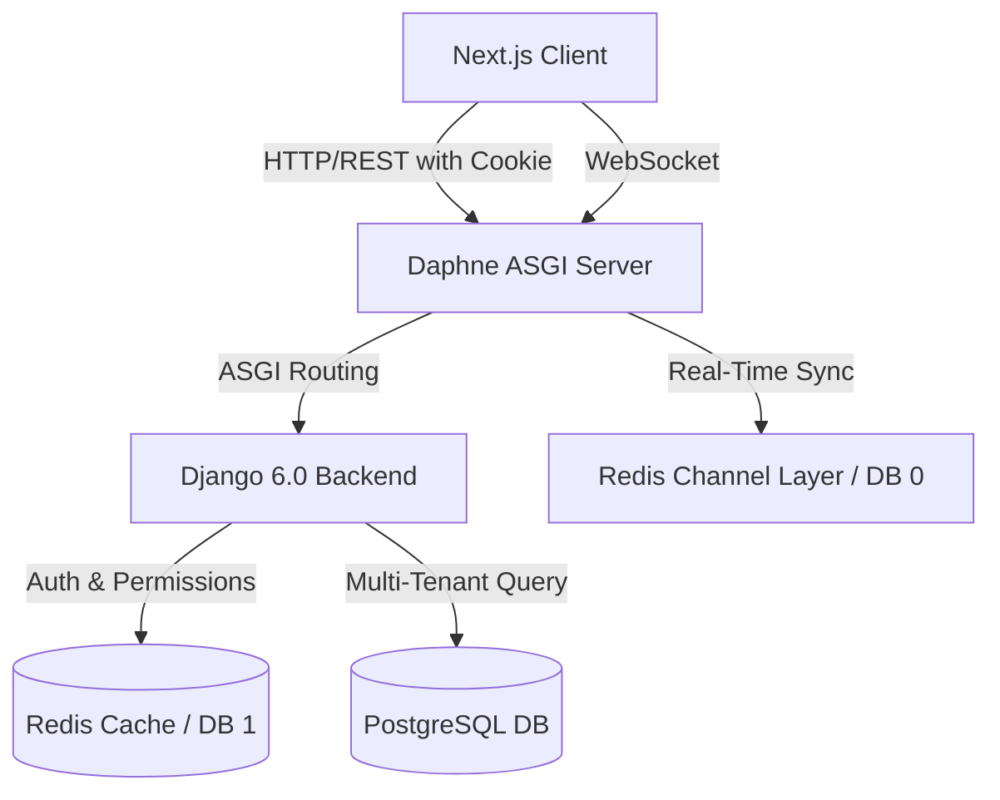
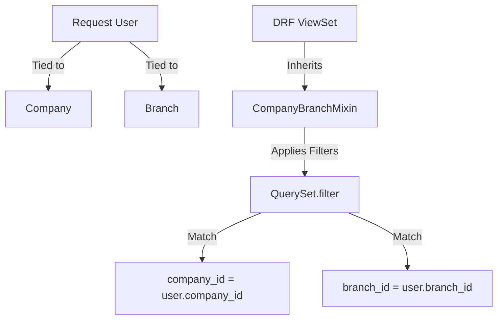
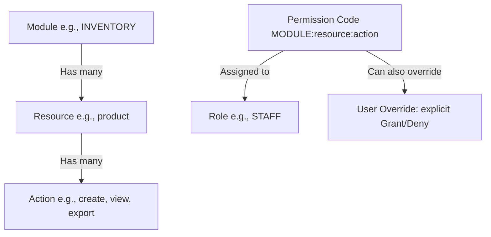
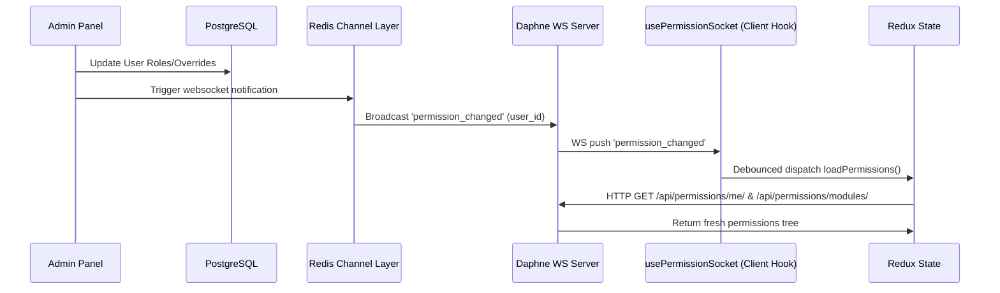
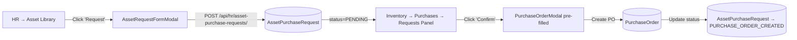

# Agent Context & System Architecture: Al-Qaiser ERP Hub

Welcome, Agent! This document acts as the single source of truth for the **Al-Qaiser ERP Hub** project. It provides an immediate overview of the system architecture, directory layouts, database schemas, and workflows to help you build, debug, and understand the codebase.

---

## 1. Project Overview & Architecture

Al-Qaiser ERP is a modular, multi-tenant Enterprise Resource Planning (ERP) application with a React-based Next.js frontend and a Python/Django backend. It is designed to manage business workflows across modules like HR, Inventory, Finance, and AI Monitoring, under a strict multi-tenant boundary.



### API URL Map
All API routes are registered in `backend/config/urls.py`:
| Prefix | App | Purpose |
|---|---|---|
| `/admin/` | django.contrib.admin | Django admin panel |
| `/health/` | — | Health check endpoint |
| `/api/accounts/` | accounts | Auth (login, logout, refresh, me) |
| `/api/hr/` | hr | Employees, payroll, leave, shifts, assets, recruitment, policies, compensation, loans |
| `/api/inventory/` | inventory | Products, variants, stock, warehouses, purchases, sales, brands, categories, customers, suppliers, transfers, barcode, alerts, audit |
| `/api/finance/` | finance | Accounts, journal entries, payments, customer invoices, supplier bills, expenses, budgets, bank accounts, payroll, reports, dashboard, trial balance, P&L, balance sheet |
| `/api/organization/` | organization | Company, branch, user management |
| `/api/company/` | compsetting | Company settings, departments, designations |
| `/api/notifications/` | notifications | WebSocket notifications |
| `/api/permissions/` | permissions | RBAC (roles, permissions, modules, user overrides, role assignment) |
| `/api/sales/` | sales | Leads, quotes, invoices, dashboard |
| `/api/forecast/` | forecast | Sales & stock forecasting |
| `/api/overall/` | overall_dashboard | Unified dashboard KPIs |
| `/api/audit/` | audit | Audit log viewer |
| `/api/common/` | common | Code generation & validation (`generate-code/`, `validate-code/`) |

### Core Technologies
*   **Frontend**: Next.js 14+ (App Router), React, Redux Toolkit (global client state), TanStack Query (server cache/queries), Tailwind CSS, shadcn/ui.
*   **Backend**: Python, Django 6.0+, Django REST Framework (DRF), Django Channels 4.1 (WebSockets), Daphne (ASGI web server).
*   **Services**: PostgreSQL 15 (primary database), Redis 7 (caching, channel layer, and permission caching).
*   **Orchestration**: Docker Compose (services: `db`, `redis`, `backend`, `frontend`).

---

## 2. Multi-Tenancy & Data Isolation

Multi-tenancy is enforced at the database level using a shared-database, shared-schema pattern with tenant columns. Data is segregated using `company_id` and `branch_id`.



### Database Representation (`BaseModel`)
The abstract base model is defined in [basemodel.py](file:///home/devteam/Documents/Projects/alqaiser/backend/apps/common/basemodel.py):
*   `id`: Primary key (`BigIntegerField`).
*   `_id`: UUID4 for API exposure (to prevent numerical ID enumeration).
*   `company_id` / `branch_id`: Indexes for tenant segregation.
*   `is_deleted`: Soft-delete flag (records are never permanently deleted on standard actions).
*   `created_by`, `updated_by`, `deleted_by`: References to the custom `User` model, updated automatically via thread-local middleware context.

### DRF Data Isolation Mixin (`CompanyBranchMixin`)
Located in [baseauthentication.py](file:///home/devteam/Documents/Projects/alqaiser/backend/apps/common/baseauthentication.py):
*   Automatically filters every query by `company_id = request.user.company_id`.
*   Restricts access by `branch_id` unless the user holds the role of `COMPANY_ADMIN` (HQ level access).
*   Filters out soft-deleted records (`is_deleted=False`).
*   **⚠️ Only works with `GenericAPIView` or `ViewSet`** (requires `get_queryset()`). Views inheriting from plain `APIView` must manually filter by `company_id`, `branch_id`, and `is_deleted=False` in each handler method.

---

## 3. Cookie-Based JWT Authentication

Authentication is fully cookie-based. Standard JWT strings are hidden from frontend scripts to mitigate XSS risks.

*   **Login Flow**: Authenticates using [LoginView](file:///home/devteam/Documents/Projects/alqaiser/backend/apps/accounts/views.py#L56-L84). It issues two secure cookies:
    *   `access_token`: HttpOnly, Lax SameSite, short-lived.
    *   `refresh_token`: HttpOnly, Lax SameSite, long-lived.
*   **DRF Hook**: [CookieJWTAuthentication](file:///home/devteam/Documents/Projects/alqaiser/backend/apps/common/authentication.py) parses cookies from `request.COOKIES` to validate JWTs. It falls back to the `Authorization: Bearer <token>` header for developer environments (e.g. Swagger docs).
*   **Token Refreshing**: [CookieTokenRefreshView](file:///home/devteam/Documents/Projects/alqaiser/backend/apps/accounts/views.py#L104-L133) reads the `refresh_token` cookie and renews the `access_token` cookie.

---

## 4. Audit Logging System

The audit app (`apps/audit/`) provides generic, signal-based audit logging for all models with UUID `_id` fields.

### How It Works
- **`post_save` signal** (`audit_create_update`): Logs `CREATE` (all fields) and `UPDATE` (changed fields only) operations.
- **`pre_delete` signal** (`audit_delete`): Logs all field values before deletion.
- Skipped for: `AuditLog` itself, Django admin/auth/sessions/contenttypes models, and models without `_id` UUID.

### Database Models
- **`AuditLog`**: Stores `user`, `action` (CREATE/UPDATE/DELETE), `model_name`, `record_id` (UUID), `module` (app label), `ip_address`, `user_agent`. Inherits `BaseModel` for multi-tenant isolation.
- **`AuditLogChange`**: Stores individual field-level changes: `field_name`, `old_value`, `new_value`. FK to `AuditLog`.

### Key Details
- The `AuditLog` model overrides `created_by`/`updated_by`/`deleted_by` with custom `related_name` to avoid clashes with the auto-populated BaseModel fields.
- Audit signals require the `_request` attribute on model instances (set via thread-local middleware in middleware.py).
- Frontend route: `/inventory/audit` and `/finance/audit` provide dedicated audit log viewers.

---

## 5. Role-Based Access Control (RBAC) & Real-Time Sync

Al-Qaiser features a customized granular access control engine instead of standard Django Groups.



### The Permission String
A permission code is constructed as: `MODULE:resource:action`. E.g.:
*   `HR:employee:view`
*   `INVENTORY:product:create`
*   `FINANCE:account:delete`

### Database Models
Defined in [permissions/models.py](file:///home/devteam/Documents/Projects/alqaiser/backend/apps/permissions/models.py):
1.  **Module**: Top-level applications (HR, INVENTORY, FINANCE, etc.).
2.  **Resource**: Business domains inside a module (employee, product, stock, etc.).
3.  **Action**: Operations (`create`, `view`, `update`, `delete`, `export`, `approve`, `reject`, `assign`, `publish`, `archive`).
4.  **Permission**: Links Resource + Action with code `MODULE:resource:action`.
5.  **Role**: Groups permissions together. System default roles are `COMPANY_ADMIN` (gets `*`), `BRANCH_ADMIN`, and `STAFF`.
6.  **UserRole**: Many-to-many relationship mapping users to roles.
7.  **UserPermission**: User-specific permission overrides (can grant or deny explicitly). Exceeds role-based rules and supports an optional `expires_at` timestamp.

### Permission Caching & Resolution
Permissions are evaluated and cached in Redis with a configurable TTL (default 5 minutes). The resolution priority is:
1.  **Superuser / System Admin**: Bypass check (always `True`).
2.  **User Override**: Check `UserPermission`. If explicit grant or deny exists, return it immediately.
3.  **Role Hierarchy**: Batch fetch all user's roles and check if the permission is granted by any of them.

### Real-Time WebSocket Synchronization
To avoid lag when permissions are changed on the backend, a reactive pipeline is in place:



1.  **WS Server**: Daphne hosts `/ws/permissions/` mapped to `PermissionConsumer` in [permission_consumer.py](file:///home/devteam/Documents/Projects/alqaiser/backend/consumers/permission_consumer.py).
2.  **Client WS Hook**: [usePermissions.ts](file:///home/devteam/Documents/Projects/alqaiser/frontend/src/hooks/usePermissions.ts) listens to WS events.
3.  **Debounced Refresh**: Upon receiving a notification for the active user, it waits `300ms` (debouncing rapid changes) and dispatches `loadPermissions()`, updating the Redux store in real-time.

---

## 6. Codebase Directory Layout

### Backend Structure (`/backend`)
```
backend/
├── apps/                          # Django modular apps
│   ├── accounts/                  # Auth views (login, logout, refresh, me)
│   ├── audit/                     # Generic audit logging via signals (AuditLog, AuditLogChange)
│   ├── common/                    # Core abstract classes & utilities
│   │   ├── authentication.py      # CookieJWTAuthentication
│   │   ├── backends.py            # EmailOrUsernameBackend
│   │   ├── baseauthentication.py  # CompanyBranchMixin
│   │   ├── basemodel.py           # BaseModel (UUID, tenant cols, soft-delete)
│   │   ├── middleware.py          # Thread-local request context
│   │   ├── serializer_fields.py   # UUIDForeignRelatedField
│   │   ├── views.py               # GenerateCodeView, ValidateCodeView (Redis atomic code gen)
│   │   └── urls.py                # /api/common/generate-code/, /api/common/validate-code/
│   ├── compsetting/               # Tenant company setup settings (CompanySettings, Department, Designation)
│   ├── finance/                   # Chart of accounts, journal entries, ledgers, payments, budgets, payroll
│   │   ├── mixins.py              # CompanyBranchUserMixin, SoftDeleteMixin
│   │   ├── models/                # account, bank, budget, customer_invoice, expense, journal, payment, supplier_bill
│   │   ├── serializers/           # Per-model serializers
│   │   ├── services/              # document, invoice_payment, payable
│   │   ├── signals.py             # WS registry + audit logging signals
│   │   └── views/                 # Per-model viewsets, dashboard, report (trial balance, P&L, balance sheet), payroll
│   ├── forecast/                  # Sales & stock forecasting
│   │   ├── analytics.py           # Forecasting analytics
│   │   ├── models.py
│   │   ├── serializers.py
│   │   ├── services.py            # DemandForecaster, StockForecaster
│   │   ├── tasks.py               # Celery tasks
│   │   ├── urls.py
│   │   └── views.py
│   ├── hr/                        # Employee directories, shifts, attendance, leaves, payroll, compensation, loans, assets, recruitment, policies, exit mgmt
│   │   ├── serializers/           # asset, asset_purchase_request, policy, recruitment, shift serializers
│   │   ├── services/              # assignment (AssetAssignmentService), shift services
│   │   └── views/                 # employee, leave, payroll, shift, asset, asset_category, employee_asset, asset_purchase_request, shift_template, recruitment, policy, exit
│   ├── inventory/                 # Products, variants, warehouses, stocks, transfers, PO/SO, brands, categories, customers, suppliers
│   │   ├── alert_utils.py         # WebSocket alert creation helper
│   │   ├── audit.py               # Separate audit engine (ThreadPoolExecutor-based)
│   │   ├── models/                # Per-model files (product, variant, stock, warehouse, purchase, sales, alert, audit, brand, category, customer, supplier, transfer, transaction, reservation)
│   │   ├── serializers/           # Per-model serializers (incl. barcode, report, stock_management)
│   │   ├── signals_audit.py       # Pre-save/post-save/post-delete audit signals for 11 models
│   │   └── views/                 # Per-feature viewsets (incl. barcode, batch_stock, report)
│   ├── monitoring/                # AI logging & workforce dashboard metrics
│   ├── notifications/             # WebSocket notification subsystem
│   │   ├── consumers.py           # NotificationConsumer (AsyncWebsocketConsumer)
│   │   ├── middleware.py          # JWTAuthCookieMiddleware
│   │   ├── models.py
│   │   ├── registry.py            # Model registration for auto-broadcast
│   │   ├── routing.py             # WebSocket URL patterns
│   │   ├── serializers.py
│   │   ├── signals.py             # Auto-broadcast on model save/delete
│   │   ├── urls.py
│   │   ├── utils.py               # broadcast_data_update, get_company_branch helpers
│   │   └── views.py
│   ├── organization/              # Company, Branch, Custom User model + seed_org management command
│   ├── overall_dashboard/         # Unified KPIs (finance + inventory + sales)
│   ├── permissions/               # Custom RBAC (Module, Resource, Action, Permission, Role, UserRole, UserPermission)
│   │   ├── checks.py              # build_permission_code, check_permission
│   │   ├── decorators.py          # require_permission_code, require_permission decorators
│   │   ├── middleware.py          # PermissionMiddleware (attaches helpers to request)
│   │   ├── mixins.py              # PermissionRequiredMixin
│   │   ├── models.py
│   │   ├── services.py            # PermissionService (Redis-backed caching layer)
│   │   ├── signals.py             # Cache invalidation + WebSocket broadcast signals
│   │   ├── urls.py
│   │   ├── views.py
│   │   └── views_extended.py      # ModulesTreeView, RoleListView, UserRolesView, AssignRoleView, etc.
│   └── sales/                     # Leads, Quotes, Invoices, Dashboard
│       ├── models/                # lead, quote
│       ├── serializers/           # lead, quote, invoice
│       ├── urls.py
│       └── views/                 # lead, quote, invoice, dashboard

├── config/                        # Django project main config
│   ├── asgi.py                    # Daphne ASGI routing (HTTP + WebSockets)
│   ├── celery.py                  # Celery app + beat schedule (forecast tasks)
│   ├── settings.py                # Main settings (SimpleJWT, CACHES, CHANNEL_LAYERS, CORS)
│   ├── urls.py                    # Root URL router mapping to sub-apps
│   └── wsgi.py                    # Standard Django WSGI
├── consumers/                     # Independent channel consumer logic
│   └── permission_consumer.py     # PermissionConsumer
├── entrypoint.sh                  # Shell startup scripts (wait-for-db, Daphne run command)
├── requirements.txt               # Main python packages list
├── manage.py                      # Django management utility
└── Dockerfile                     # Docker container config
```

### Frontend Structure (`/frontend`)
```
frontend/src/
├── app/                           # Next.js App Router folders
│   ├── (app)/                     # Authenticated layout group
│   │   ├── dashboard/             # Overall ERP dashboard page
│   │   ├── hr/                    # HR routes (employees, payroll, leave, attendance, shifts, assets, recruitment, compensation, exit, policies, performance)
│   │   ├── inventory/             # Inventory routes (dashboard, products, stock, warehouses, purchases, suppliers, transfers, barcode, reports, alerts, customers, pos, audit, brands, categories)
│   │   ├── sales/                 # Sales routes (dashboard, leads, quotes, customers, customer-invoices)
│   │   ├── finance/               # Finance routes (dashboard, accounts, expenses, budgets, bank-accounts, supplier-bills, payments, journal-entries, reports, payroll, taxes, audit, forecast, assets, forecasting)
│   │   ├── monitoring/            # AI Monitoring routes (dashboard, activity-tracking, inventory-monitoring, workforce-monitoring, alerts-events, reports-insights, warehouse)
│   │   ├── settings/              # Settings routes (company, users, departments, designations, permissions, preferences)
│   │   └── page.tsx               # Root redirect → /dashboard
│   ├── demo/                      # Demo page
│   ├── login/                     # Simple username/password login page
│   ├── unauthorized/              # Standard access-denied route
│   └── layout.tsx / providers.tsx # Context wrap setup (Redux + React Query Providers)
├── components/                    # Sharable React/shadcn UI components
│   ├── payroll/                   # Payroll, Compensation, Loan forms/tables/modals
│   ├── leave/                     # Leave form modals
│   ├── finance/                   # Finance-specific (accounts, bank, budgets, customer-invoices, expenses, payments, supplier-bills)
│   ├── inventory/                 # Inventory-specific (brand, category, customers, pos, product, purchase, stock, supplier, transfers, warehouse)
│   ├── sales/                     # Sales-specific components (CustomerCreationModal, LeadFormModal, LeadsPanel, QuoteFormModal, QuotesPanel)
│   ├── settings/                  # Settings-specific (departments, designations)
│   ├── HRAssets/                  # HR asset management (AssetCategories, AssetsList, EmployeeAssetsNew)
│   ├── monitoring/                # Monitoring views
│   ├── recruitment/               # Recruitment components (RoundBuilder, RoundStatusModal)
│   ├── reuseable/                 # Reusable (Checkbox, ConfirmationModal, CurrencySelect, DataTable, DatePicker, DateRangePickerRac, EmployeeMultiSelect, FormModal, FormSelectWithCreate, LocationSelectors, SearchableSelect, StatsCards, TableGridView)
│   │   └── final/                 # DetailLayout, DynamicModulePage, workflow
│   ├── cards/                     # Shared card components (StatCard)
│   ├── Forms/                     # EmployeeForm.jsx, UserForm.tsx
│   ├── navbar/                    # Top navigation bar (Topbar)
│   ├── sidebar/                   # Sidebar navigation (Sidebar)
│   ├── ui/                        # shadcn/ui primitives (49 components)
│   ├── CrudPage.tsx               # Generic CRUD page component
│   ├── CustomersPanel.tsx         # Customer panel
│   ├── EmployeeStatusModal.tsx    # Employee status modal
│   ├── PageHeader.tsx             # Page header component
│   ├── PermissionGuard.tsx        # Route guard component
│   ├── reuseableComponents.tsx    # Extra reusable components
│   ├── ThemeInitializer.tsx       # Theme initialization
│   └── UserStatusModal.tsx        # User status modal
├── config/                        # Configuration mappings
│   ├── routePermissions.ts        # Maps absolute routes to permission strings + menuPermissionMapping
│   ├── menu.js                    # Menu configuration
│   ├── monitoringFeeds.js         # Monitoring feed configurations
│   └── schemas.js                 # Form schemas
├── contexts/                      # Shared context classes
│   ├── NotificationContext.tsx     # WebSocket notification consumer + React Query cache invalidation
│   └── ConfirmationModalContext.tsx # Confirmation modal state management
├── hooks/                         # Global React Hooks (60+ total)
│   ├── sales/                     # useLeads, useQuotes, useSalesDashboard
│   ├── finance/                   # useAccounts, useAgingReports, useAuditLogs, useBalanceSheet, useBank, useBudgets, useCustomerInvoices, useExpenseReport, useExpenses, useFinanceDashboard, useForecast, useJournalEntries, usePayments, useProfitLoss, useSupplierBills, useTrialBalance
│   ├── overall/                   # useOverallDashboard
│   ├── useAlerts.ts / useAllVariants.ts / useApi.ts / useAutoCode.ts / useAssetCategories.ts / useAssets.ts / useAudit.ts / useAuditLogs.ts / useAuth.ts / useBarcodes.ts / useBatchStock.ts / useBranches.ts / useBrands.ts / useCategories.ts / useCompanySettings.ts / useCustomers.ts / useDepartments.ts / useDesignations.ts / useEmployeeAssets.ts / useEmployees.ts / useExitManagement.ts / useFeaturePermissions.ts / useFormatCurrency.ts / useGoodsReceipts.ts / useIncomingStock.ts / useInterviewRound.ts / useInventoryDashboard.ts / useLeaves.ts / use-mobile.tsx / usePayroll.ts / usePermissions.ts / usePolicies.ts / useProducts.ts / usePurchaseOrders.ts / useRecruitment.ts / useReports.ts / useSalesOrder.ts / useShiftManagement.ts / useShiftTemplates.ts / useStockManagement.ts / useSuppliers.ts / useTransfers.ts / useUserProfile.ts / useUsers.ts / useWarehouses.ts
├── layouts/                       # Layout components
│   └── AppLayout.tsx              # Main UI Shell. Watches route guards & company setup status
├── lib/                           # Utility scripts
│   ├── api.ts                     # Core `apiFetch` wrapper mapping methods to toast notifications
│   ├── notifications.ts           # Notification helper utilities
│   ├── permissions.ts             # Permission check utilities
│   ├── productAttributes.ts       # Product attribute helpers
│   ├── shiftResolver.ts           # Shift scheduling utilities
│   └── utils.ts                   # General utility functions
├── seed/                          # System initialization
│   └── initializeSystem.js        # System bootstrap script
├── services/                      # Service layer
│   └── localStorageService.ts     # Local storage persistence service
├── staticdata/                    # Static reference data
│   └── finance-data.ts            # Finance seed data constants
├── store/                         # Redux Toolkit setup
│   ├── index.ts                   # Store initialization export
│   ├── reset.ts                   # State reset logic
│   └── slices/                    # authSlice, permissionSlice, themeSlice, companySettingsSlice
├── types/                         # Shared typescript types definitions
│   ├── policy.ts
│   ├── purchase.ts
│   └── shifts.ts
└── styles.css                     # Global styles configuration
```

---

## 7. Key Developer Workflows

### Creating a New Backend API Model
When creating models, make sure to:
1.  Inherit from [BaseModel](file:///home/devteam/Documents/Projects/alqaiser/backend/apps/common/basemodel.py) to enable multi-tenant columns (`company_id`, `branch_id`), UUID lookup (`_id`), and soft deletes (`is_deleted`).
2.  Inherit your view from [CompanyBranchMixin](file:///home/devteam/Documents/Projects/alqaiser/backend/apps/common/baseauthentication.py) to automatically isolate records based on company. **⚠️ Only use with `GenericAPIView`/`ViewSet` — plain `APIView` does not have `get_queryset()`**. For `APIView`, manually filter by `company_id`, `branch_id`, and `is_deleted=False` in each method.
3.  Inherit your view from [PermissionRequiredMixin](file:///home/devteam/Documents/Projects/alqaiser/backend/apps/permissions/mixins.py) to validate permissions, specifying:
    ```python
    permission_module = 'INVENTORY'
    permission_resource = 'brand'
    ```
4.  Audit logging is automatic via signals (no manual action needed) — models with `_id` UUID fields are tracked by `apps/audit/signals.py`.
5.  For real-time cache invalidation, send WebSocket `data_update` events from your views after mutations (see rule #4 above).

### Employee API Serialization

Both the **all employees** (`GET /api/hr/employees/`) and **active employees** (`GET /api/hr/employees/active/`) endpoints use the same shared `serialize_employee()` function defined in `backend/apps/hr/views/employee_views.py`. This function returns a full employee record with 37 fields including department/designation details, reporting manager, default shift resolution, and bank info.

**Key details:**
- `serialize_employee()` is a module-level function (not a view method) — reusable across views.
- Both endpoints use `select_related('default_shift', 'reporting_manager', 'department', 'designation')`.
- The active employees endpoint filters by `employment_status='ACTIVE'` and returns the same shape as all employees.
- Frontend TypeScript interfaces `Employee` and `ActiveEmployee` (in `useEmployees.ts`) both match this serialization shape with fields like `department_id`, `department_name`, `designation_id`, `designation_name`.

**Frontend usage:**
- `useEmployees()` → `GET /api/hr/employees/` → `Employee[]`
- `useActiveEmployees()` → `GET /api/hr/employees/active/` → `ActiveEmployee[]`

### Creating a New Django App
1. Create the app under `backend/apps/` with `python manage.py startapp <name> backend/apps/<name>`.
2. Add it to `INSTALLED_APPS` in `backend/config/settings.py`.
3. Register API routes in `backend/config/urls.py` under the `/api/` prefix.
4. Add Module/Resource/Action entries in `seed_permissions.py` for RBAC.
5. Create frontend route + permission mapping in `routePermissions.ts`.
6. Add entity-to-query-key mapping in `NotificationContext.tsx` for cache invalidation.

### Protecting a Frontend Next.js Route
1.  Create your page folder under `src/app/(app)/my-feature/page.tsx`.
2.  Add route mappings in [routePermissions.ts](file:///home/devteam/Documents/Projects/alqaiser/frontend/src/config/routePermissions.ts):
    ```typescript
    "/my-feature": "MODULE:resource:view"
    ```
3.  Add sidebar filters in `menuPermissionMapping` using the menu title to hide sidebar navigation dynamically if the user lacks access.
4.  For nested route groups (e.g. `/hr/compensation/[id]`), the `getRequiredPermission()` helper uses prefix matching — parent route permission covers nested paths.

### Adding Real-Time Cache Invalidation for a New Entity
1. Add entity name → query keys mapping in `NotificationContext.tsx` ENTITY_TO_QUERY_KEY:
   ```typescript
   my_entity: ["myEntity", "myEntityStats"]
   ```
2. From backend views, trigger WebSocket after mutations:
   ```python
   from channels.layers import get_channel_layer
   from asgiref.sync import async_to_sync
   channel_layer = get_channel_layer()
   async_to_sync(channel_layer.group_send)(
       f"notify_c{company_id}_b{branch_id}",
       {"type": "data_update", "entity": "my_entity", "action": "created", "record_id": obj._id}
   )
   ```

---

## 8. Initialization & Environment Seeding

### Seeding commands (Run inside the Django backend container)
Run the following commands inside `docker-compose exec backend <cmd>` to populate standard system data:

1.  **Seed Organization**: Setup company & default branch.
    ```bash
    python manage.py seed_org
    ```
    *(Uses variables from the backend's environment: `ORG_COMPANY_NAME`, `ORG_ADMIN_USERNAME`, `ORG_ADMIN_PASSWORD`)*
2.  **Seed Permissions Matrix**: Create all modules, resources, actions, permissions, and link system admin permissions.
    ```bash
    python manage.py seed_permissions
    ```
3.  **Seed Chart of Accounts**: Setup basic finance bookkeeping templates.
    ```bash
    python manage.py seed_chart_of_accounts --company-id=1 --branch-id=1
    ```

> **Order matters**: Run `seed_org` first (creates company + admin user), then `seed_permissions` (creates RBAC matrix), then `seed_chart_of_accounts` (creates finance templates).

### Management Commands Summary
| Command | Source | Description |
|---|---|---|
| `seed_org` | `apps/organization/management/commands/seed_org.py` | Creates company, default branch, and admin user |
| `seed_permissions` | `apps/permissions/management/commands/seed_permissions.py` | Seeds modules, resources, actions, permissions, roles |
| `seed_chart_of_accounts` | `apps/finance/management/commands/seed_chart_of_accounts.py` | Seeds finance COA templates |

### Docker Port Layout (Dev Environment)
*   **Host Port 3000**: Next.js App dev server.
*   **Host Port 8000**: Daphne ASGI backend server (serves REST endpoints under `/api/` and WS under `/ws/`).
*   **Host Port 5433**: PostgreSQL (mapped from container `5432`).
*   **Host Port 6379**: Redis (used for CACHES, WS Channel Layer, and permission cache store).

---

---

## 9. **AI AGENT RULES & GUIDELINES** (Copilot CLI, Gemini, and Other AI Assistants)

### Critical Restrictions
> [!IMPORTANT]
> **AI CLI MUST NOT** run any git command under any circumstances. This includes but is not limited to:
> - `git commit`, `git push`, `git pull`, `git merge`, `git rebase`, `git checkout`, `git branch`, `git add`, `git reset`, `git stash`, `git revert`, `git cherry-pick`, or any other git command
> - `python manage.py migrate`, `python manage.py makemigrations`, or any Django migration command
> - Any destructive database operations without explicit user confirmation

### Data & API Usage Rules

#### **1. Always Use Dynamic Data**
- **Never hardcode** static values, IDs, or test data in code.
- Fetch all data from the database/API at runtime using the backend endpoints.
- For dropdown lists, categories, or enums, use the API responses or query the database.
- Example: Instead of hardcoding `["draft", "published", "archived"]`, fetch statuses from the backend response or enum.

#### **2. Toast Notifications - Single Source of Truth**
- **ONLY** use the toast system defined in `@frontend/src/lib/api.ts` (`apiFetch` wrapper).
- **DO NOT** create alternative notification files (e.g., separate toast service, custom notification handler).
- The `apiFetch` function automatically shows:
  - ✅ **Success toast** for POST, PUT, PATCH, DELETE operations with `message` or `detail` in response.
  - ❌ **Error toast** for failed requests.
- **DO NOT** add manual `toast.success()` or `toast.error()` calls for API responses in components — `apiFetch` already handles this. Adding duplicate toasts causes the same message to appear twice.
- **ONLY** use manual `toast` calls for **frontend-only validation** scenarios:
  - Form field validation errors (e.g., "Please fill in all required fields")
  - Client-side input validation (e.g., "End date cannot be before start date")
  - Confirmation feedback not tied to an API call (e.g., "Copied to clipboard")
- All backend responses should include `message` or `detail` fields for user feedback.
- Example API response:
  ```json
  {
    "id": "uuid-123",
    "message": "Employee created successfully",
    "detail": "Employee John Doe added to the system"
  }
  ```
- Example of frontend-only toast usage (ALLOWED):
  ```typescript
  // ✅ CORRECT - frontend validation, no API call
  if (!formData.name) {
    toast.error("Please enter a name");
    return;
  }
  ```
- Example of redundant toast (FORBIDDEN):
  ```typescript
  // ❌ WRONG - apiFetch already shows toast for this API call
  const { mutate } = useMutation({
    mutationFn: (data) => api("/api/hr/employees/", { method: "POST", body: JSON.stringify(data) }),
    onSuccess: () => {
      toast.success("Employee created"); // REDUNDANT - apiFetch already shows this
      queryClient.invalidateQueries({ queryKey: ["employees"] });
    }
  });
  ```

#### **3. WebSocket Integration & Real-Time Updates**
- Use WebSocket for real-time data synchronization and notifications.
- **Notification WebSocket** (`/ws/notifications/{company_id}/{branch_id}/`):
  - Handles real-time notifications pushed to users.
  - Managed by `NotificationProvider` in `@frontend/src/contexts/NotificationContext.tsx`.
  - Emits `type: "notification"` events for user alerts.
  - Emits `type: "data_update"` events for cache invalidation (entity name and action).
  
- **Permission WebSocket** (`/ws/permissions/`):
  - Pushes permission changes in real-time via `permission_changed` event.
  - Triggers Redux state update in `usePermissions.ts` hook.
  - Debounced to avoid spam (300ms delay).

- **Backend Consumer Pattern** (in `/backend/consumers/`):
  ```python
  class NotificationConsumer(AsyncWebsocketConsumer):
      async def connect(self):
          await self.channel_layer.group_add(...)
          await self.accept()
      
      async def notify_event(self, event):
          await self.send(text_data=json.dumps(event))
  ```

- **Frontend Hook Pattern** (React Query cache invalidation):
  ```typescript
  const [notifications, setNotifications] = useState([]);
  const queryClient = useQueryClient();
  
  // On WebSocket message:
  if (data.type === "data_update") {
    const { entity, action } = data;
    queryClient.invalidateQueries({ queryKey: [entity] }); // Refetch data
  }
  ```

#### **4. Update NotificationContext & Trigger Cache Refresh**
When implementing data mutations or real-time features:
- Trigger WebSocket events that emit `type: "data_update"` with entity name.
- The `NotificationContext` will automatically invalidate React Query caches via `ENTITY_TO_QUERY_KEY` mapping.
- Current entity-to-query-key mappings in `@frontend/src/contexts/NotificationContext.tsx`:

| Backend Entity | React Query Keys Invalidated |
|---|---|
| `employees` | `employees`, `employeeStats` |
| `leaves` | `leaves`, `leaveStats`, `leaveBalances` |
| `payroll` | `payroll`, `payrollStats` |
| `compensations` | `compensations` |
| `loans` | `loans`, `employeeLoans` |
| `inventory_product` | `inventory_product` |
| `inventory_variant` | `inventory_variant`, `batchStock` |
| `inventory_stock` | `inventory_stock`, `batchStock` |
| `inventory_sales_order` | `inventory_sales_order` |
| `finance_customer_invoice` | `finance_customer_invoice` |
| ... | (full list in file) |

- Example backend trigger:
  ```python
  from asgiref.sync import async_to_sync
  from channels.layers import get_channel_layer
  
  channel_layer = get_channel_layer()
  async_to_sync(channel_layer.group_send)(
      f"notify_c{company_id}_b{branch_id}",
      {
          "type": "data_update",
          "entity": "inventory_product",
          "action": "created",
          "record_id": product._id
      }
  )
  ```

#### **5. Multi-Tenant Data Isolation**
- **Always** query by `company_id` and `branch_id` from `request.user`.
- Use `CompanyBranchMixin` in DRF `ViewSet`/`GenericAPIView` classes to auto-filter queries. **Do NOT inherit it on plain `APIView`** (it requires `get_queryset()`). For `APIView`, manually filter by `company_id`, `branch_id`, and `is_deleted=False` in each handler method.
- Use `_id` (UUID) for API lookups, NOT `id` (auto-increment).
- Never expose raw `id` fields in API responses (security risk - ID enumeration).
- All model serializers should expose `_id` as the identifier.

#### **6. Permission Checks & RBAC**
- Use `PermissionRequiredMixin` on backend ViewSets with module/resource/action.
- Frontend: Check permissions via Redux slice (`state.permissions.modules`).
- Use `usePermissions()` hook to sync permission changes with WebSocket.
- Implement route guards on protected pages using `routePermissions.ts` mapping.

#### **6a. Always Use Dynamic Permissions (NEVER Hardcode)**
- **NEVER** hardcode `true`/`false` for any permission value — always use the result from `useFeaturePermissions()`:
  ```typescript
  // ❌ WRONG
  const modulePermissions = { view: true, create: true, export: true };
  <DynamicModulePage exportEnabled={true} ... />

  // ✅ CORRECT
  const permissions = useFeaturePermissions("MODULE", "resource");
  const modulePermissions = {
    view: permissions.view,
    create: permissions.create,
    update: permissions.update,
    delete: permissions.delete,
    export: permissions.export,
  };
  <DynamicModulePage exportEnabled={permissions.export} ... />
  ```
- The `"export"` action is defined on every resource in `seed_permissions.py`. Use `permissions.export` instead of `export: true`.
- For `DynamicModulePage`, always pass `exportEnabled={permissions.export}` — never `exportEnabled` or `exportEnabled={true}`.
- For inline toolbar Export buttons, wrap with `{permissions.export && <ToolbarButton>Export</ToolbarButton>}`.
- The resource name in `useFeaturePermissions(MODULE, resource)` must match the exact snake_case code in `seed_permissions.py` (e.g. `"supplier_bill"` not `"supplierbill"`, `"journal_entrie"` not `"journal"`, `"customer_invoice"` not `"customerinvoice"`).

#### **7. API Response Structure**
All backend API responses should follow this pattern:
```json
{
  "id": "UUID (exposed as _id in serializers)",
  "message": "Human-readable success/status message",
  "detail": "Optional detailed description",
  "data": { /* main response body */ },
  "errors": { /* field-level validation errors (POST/PUT/PATCH) */ }
}
```

#### **8. React Query & TanStack Query**
- Leverage React Query hooks in `/frontend/src/hooks/` for server-state management.
- All hooks use `apiFetch` internally (already integrated with toast).
- Cache keys follow pattern: `[entity, entityId]` or `[entity, "stats"]`.
- Use `invalidateQueries` when mutations succeed.
- Example hook pattern:
  ```typescript
  export function useProducts() {
    return useQuery({
      queryKey: ["inventory_product"],
      queryFn: () => api("/api/inventory/products/", { method: "GET" })
    });
  }
  ```

#### **9. Backend Serializers & Responses**
- Always inherit from `DRF Serializers` (or model serializers).
- Include `_id` (UUID) field in serializers for API exposure.
- Add `message`/`detail` fields in `create()`, `update()`, `destroy()` methods.
- Use `CompanyBranchMixin` + `PermissionRequiredMixin` on ViewSets.
- Example:
  ```python
  class ProductViewSet(viewsets.ModelViewSet, CompanyBranchMixin, PermissionRequiredMixin):
      permission_module = 'INVENTORY'
      permission_resource = 'product'
      queryset = Product.objects.all()
      serializer_class = ProductSerializer
      
      def perform_create(self, serializer):
          serializer.save(created_by=self.request.user)
  ```

#### **10. Frontend Component Patterns**
- Use hooks from `/frontend/src/hooks/` for data fetching.
- Call `apiFetch` via `useApi()` hook for mutations.
- Handle loading/error states with React Query.
- Example form submission:
  ```typescript
  const api = useApi();
  const { mutate: createProduct } = useMutation({
    mutationFn: (data) => api("/api/inventory/products/", { 
      method: "POST", 
      body: JSON.stringify(data) 
    }),
    onSuccess: () => {
      queryClient.invalidateQueries({ queryKey: ["inventory_product"] });
    }
  });
  ```

#### **11. Environment & Configuration**
- Never commit `.env` files or secrets.
- Use `NEXT_PUBLIC_*` prefix only for client-safe values in frontend.
- Backend environment variables are injected via Docker Compose.
- Frontend API URL: `process.env.NEXT_PUBLIC_API_URL` (e.g., `http://localhost:8000`).

#### **12. When NOT to Use apiFetch Directly**
Do **NOT** bypass `apiFetch` in these cases:
- File uploads (use multipart form data with special handling).
- WebSocket connections (use dedicated consumer classes).
- Streaming responses (use native fetch with streaming).
- For these, wrap the response in toast notifications manually if needed.

#### **13. Inline "Add New" Pattern for Dropdowns**
When a form contains a dropdown/select for a related entity (e.g., Department or Designation), allow users to create that entity inline without leaving the form:

- **`SearchableSelect`** supports `onAddNew` and `addNewLabel` props (defined in `frontend/src/components/reuseable/SearchableSelect.tsx`). When provided, an "+ Add New" item renders at the bottom of the dropdown list.
- Clicking "+ Add New" opens a small overlay modal (the entity's creation form) on top of the parent form.
- The **parent form stays open** and **all filled fields are preserved** — the sub-modal is a separate overlay (`fixed z-50`) that renders above it.
- After the sub-modal successfully creates the record, call `refetch()` on the parent's data hook so the new option appears in the dropdown.
- Examples in the codebase:
  - `EmployeeForm.jsx` — Department and Designation dropdowns have `onAddNew` opening `DepartmentFormModal` / `DesignationFormModal`.
  - `UserForm.tsx` — Same pattern for both dropdowns.
  - `DesignationFormModal.tsx` — Department label has a "+ Add New" button (native `<select>`, not `SearchableSelect`) opening `DepartmentFormModal`.
- Do NOT add separate "New Department" / "New Designation" buttons at the page header level. Keep the creation entry point inside the relevant dropdown.

#### **14. Always Use Atomic Transactions for Mutations**
- All write operations (POST, PATCH, PUT, DELETE) in Django views **MUST** be wrapped with `@transaction.atomic` decorator.
- All related child records must be created within the same atomic transaction to ensure data consistency.
- Use `transaction.atomic()` context manager for in-function scoping when decorator is not suitable.
- Never partially create related records - if any child record creation fails, the entire operation must roll back.
- Example:
  ```python
  @transaction.atomic
  def post(self, request):
      # All DB operations within this method are atomic
      parent = ParentModel.objects.create(...)
      ChildModel.objects.create(parent=parent, ...)
      return Response(...)  # Either all succeed or all rollback
  ```

#### **15. Use RESTful URLs for Mutations**
- All PATCH, PUT, and DELETE requests **MUST** target the detail endpoint with the resource ID in the URL path: `PATCH /api/hr/loans/{pk}/`, `DELETE /api/hr/loans/{pk}/`.
- Do **NOT** send `id` in the request body for mutations — use the URL path parameter instead.
- Backend handler methods **MUST** accept `pk=None` with fallback `pk or request.data.get('id')` for backward compatibility during migration.
- Frontend mutation hooks should extract `id` from the data object and construct the URL before calling `apiFetch`:
  ```typescript
  mutationFn: (data: any) => {
    const { id, ...rest } = data;
    return api(`/api/hr/loans/${id}/`, { method: "PATCH", body: JSON.stringify(rest) });
  }
  ```
- This ensures proper REST semantics and enables URL-based caching and idempotency.

#### **16. Auto Code Generation (ALWAYS use for code/ID fields)**
- **NEVER** hardcode or client-side generate codes/IDs (e.g., `EMP-${counter}`, `BRN-001`).
- Use the `useAutoCode(entity)` hook for all code/ID form fields:
  - `generateCode()` — call on modal open to populate field with a unique code
  - `validateCode(code)` — call on blur to check DB uniqueness, shows toast if taken
- Backend: When adding a new model with a code field, register it in `CODE_REGISTRY` in `apps/common/views.py` with its app, model, field name, and default prefix.
- The system uses **Redis atomic `INCR`** for concurrency safety — two users opening the same form simultaneously get different codes.
- Always add a regenerate button (RotateCw icon) next to the code input for manual re-generation.

#### **17. Leave Form Date Validation (Frontend & Backend)**
When implementing or updating Leave forms and APIs, enforce the following rules to prevent invalid date ranges and incorrect leave applications:

- Frontend: The leave period picker must prevent or validate selection where the end date is before the start date. Forms should show a clear error (e.g., "End date cannot be before start date") and block submission until corrected. Use the shared DateRangePicker components and validate onChange and before submit.
- Backend: The leave creation/update endpoints must validate that the employee's joining_date is strictly before the leave start_date. If the employee has not joined before the requested leave starts, return HTTP 400 with a descriptive error message (e.g., "Employee must have joined before the leave start date").
- Rationale: Prevents applying leave for periods that are chronologically invalid or before employment begins. Keep validation on both client and server for UX and security.

---

---

> [!IMPORTANT]
> Always verify that your model queries fetch using `_id` (UUID) in the API views instead of `id` (bigint auto-increment) to comply with lookup configurations.
> **AI agents MUST NOT:**
> - Run any git, migration, or destructive database commands
> - Use static/hardcoded data
> - Create alternative notification systems (use `apiFetch` + `NotificationContext`)
> - Expose `id` fields in API responses (use `_id` only)

---

> [!IMPORTANT]
> **ALWAYS USE PURE POSTGRESQL RELATIONAL DB FORMAT**
> - Use proper relational database design patterns with PostgreSQL
> - Define explicit foreign key relationships between models
> - Use appropriate data types (e.g., `DecimalField` for money, `PositiveSmallIntegerField` for months/years)
> - Create database indexes for frequently queried columns
- Use `unique_together` constraints where needed for data integrity
> - Follow PostgreSQL naming conventions (snake_case for tables and columns)
> - Use `JSONField` only for truly unstructured data; prefer normalized tables for relational data
> - Always use `on_delete` behavior explicitly (CASCADE, SET_NULL, etc.)

---

## 10. Compensation & Loan Module - IMPLEMENTED

### Compensation Model Schema

| Field | Type | Notes |
|---|---|---|
| `employee` | FK → Employee | Cascade delete |
| `house_rent_allowance` | Decimal(12,2) | Default 0 |
| `medical_allowance` | Decimal(12,2) | Default 0 |
| `transport_allowance` | Decimal(12,2) | Default 0 |
| `phone_allowance` | Decimal(12,2) | Default 0 |
| `utilities_allowance` | Decimal(12,2) | Default 0 |
| `education_allowance` | Decimal(12,2) | Default 0 |
| `other_allowances` | Decimal(12,2) | Default 0 |
| `employer_pf` | Decimal(12,2) | Employer PF contribution |
| `employer_eobi` | Decimal(12,2) | Employer EOBI contribution |
| `overtime_rate` | Decimal(12,2) | Per hour |
| `bonus_percentage` | Decimal(5,2) | Bonus % of salary |
| `frequency_type` | CharField | ONE_TIME / SELECTED_MONTH / MONTH_RANGE |
| `status` | CharField | ACTIVE / INACTIVE (single source of truth) |
| `review_date` | Date | Nullable |
| `notes` | Text | Nullable |

#### Fields REMOVED from `Compensation` model (post-refactor):
- `grade` (CharField) - Removed
- `effective_date` (DateField) - Removed
- `is_active` (BooleanField) - Removed (redundant with `status`)

#### Computed Properties:
- `total_allowances` → sum of all 7 allowance fields
- `total_ctc` → `total_allowances + employer_pf + employer_eobi`
- `total_monthly` → `total_allowances` (aliased)

#### Child Tables:
- `CompensationSelectedMonth` - Stores multiple selected months for SELECTED_MONTH frequency (`compensation` FK, `month`, `year`, `unique_together`)
- `CompensationMonthRange` - Stores start/end range for MONTH_RANGE frequency (`compensation` OneToOne, `start_month`, `start_year`, `end_month`, `end_year`)

### Loan Model Schema

| Field | Type | Notes |
|---|---|---|
| `employee` | FK → Employee | Cascade delete |
| `loan_type` | CharField | PERSONAL_LOAN / SALARY_ADVANCE / CAR_LOAN / HOUSE_LOAN / EDUCATION_LOAN / MEDICAL_LOAN / EMERGENCY_LOAN / OTHER |
| `principal_amount` | Decimal(12,2) | |
| `remaining_amount` | Decimal(12,2) | Updated by payroll processing |
| `paid_amount` | Decimal(12,2) | Default 0 |
| `paid_months` | PositiveInteger | Default 0 |
| `interest_rate` | Decimal(5,2) | Percentage |
| `total_payable` | Decimal(12,2) | principal + interest |
| `frequency_type` | CharField | ONE_TIME / SELECTED_MONTH / MONTH_RANGE |
| `status` | CharField | PENDING / ACTIVE / PAID / DEFAULTED / CANCELLED |
| `purpose` | Text | Nullable |
| `approved_by` | FK → User | Nullable, SET_NULL |
| `approved_at` | DateTime | Nullable |
| `notes` | Text | Nullable |
| `transaction_number` | CharField | Auto-generated `LN-YYYYMMDD-{emp_code}` |

#### Fields REMOVED from `EmployeeLoan` model (post-refactor):
- `monthly_deduction` (DecimalField) - Removed (now in child tables)
- `total_months` (PositiveIntegerField) - Removed
- `start_date` (DateField) - Removed
- `end_date` (DateField) - Removed (unvalidated, duplicative)

#### Child Tables:
- `LoanSelectedMonth` - Stores multiple selected months + editable deduction for SELECTED_MONTH frequency
- `LoanMonthRange` - Stores start/end range + auto-calculated deduction for MONTH_RANGE frequency

### Payroll Linking Models

| Model | Purpose | FK Fields |
|---|---|---|
| `PayrollCompensation` | Links `PayrollRecord` ↔ `Compensation` | `payroll` → PayrollRecord, `compensation` → Compensation, `amount` |
| `PayrollLoanDeduction` | Links `PayrollRecord` ↔ `EmployeeLoan` | `payroll` → PayrollRecord, `loan` → EmployeeLoan, `principal_amount`, `interest_amount`, `total_amount` |

These are populated during payroll processing (`PayrollView.post`). Each `PayrollRecord` has `month` and `year` fields (unique per employee + month + year). The `paid_months_set` field in detail serializers queries these linking tables to determine which months have been processed for a given compensation or loan.

### Frequency Type Behavior

| Frequency | Compensation UI | Loan UI |
|---|---|---|
| **ONE_TIME** | Single month select | Single month select + auto-calculated editable deduction |
| **SELECTED_MONTH** | Multi-select month grid | Multi-select month grid + per-month editable deduction fields |
| **MONTH_RANGE** | Start/end month+year dropdowns | Start/end month+year dropdowns + auto-calculated read-only deduction |

Validation rules apply to all:
- End month/year must not be before start month/year
- Start month/year must not be before employee's joining_date
- Month dropdowns are year-aware: if start_year > joining_year, all 12 months shown; if start_year === joining_year, only months >= joining month shown

### Critical Implementation Rules

#### 1. Atomic Transactions
Every POST/PATCH/DELETE method in `payroll_views.py` **MUST** be decorated with `@transaction.atomic` because:
- Compensations create child records (selected_months, month_range) atomically
- Loans create child records (selected_months, month_range) atomically
- Payroll processing creates PayrollRecord + PayrollCompensation + PayrollLoanDeduction atomically
- Status updates modify `paid_amount`, `remaining_amount`, `paid_months` atomically

#### 2. RESTful URL Pattern (not legacy body ID)
Update and delete mutations use proper RESTful URLs:
- `PATCH /api/hr/loans/{pk}/` (not `PATCH /api/hr/loans/` with `id` in body)
- `DELETE /api/hr/loans/{pk}/` (not `DELETE /api/hr/loans/` with `id` in body)
- Same for compensations: `PATCH /api/hr/compensations/{pk}/`, `DELETE /api/hr/compensations/{pk}/`
- Backend views accept `pk=None` with fallback `pk or request.data.get('id')` for backward compatibility

#### 3. Data Isolation
Views manually filter by `company_id`, `branch_id`, and `is_deleted=False` in each method. `CompanyBranchMixin` is NOT used because these are `APIView`-based (the mixin requires `GenericAPIView`/`ViewSet` with `get_queryset()`).

#### 4. Paid Status on Detail Pages
Both detail pages show paid/unpaid status per month:
- **Loan detail page**: Each month row displays a green "PAID" or grey "UNPAID" badge, determined by checking `PayrollLoanDeduction` records linked to the loan
- **Compensation detail page**: Each month displays a green checkmark if a `PayrollCompensation` record exists for that compensation + month
- The `paid_months_set` field returns `[[month, year], ...]` tuples from the backend

### Frontend Forms (post-refactor)

#### CompensationForm.tsx
- Employee select (with joining-date-aware month filtering)
- Overtime rate input
- Collapsible frequency type selector (ONE_TIME/SELECTED_MONTH/MONTH_RANGE)
  - Month grid for ONE_TIME/SELECTED_MONTH (year-aware, joining-date-filtered)
  - Start/end month+year dropdowns for MONTH_RANGE (year-aware, joining-date-filtered)
- Allowances section (7 allowance fields with currency formatting)
- Employer contributions section (employer PF, employer EOBI, bonus percentage)
- Notes textarea

#### LoanForm.tsx
- Employee select (shows monthly salary)
- Loan type dropdown (8 types)
- Principal amount + interest rate
- Collapsible frequency type selector
  - Month grid with per-month editable deduction inputs (auto-calculated, sum must equal total payable)
  - Start/end month+year dropdowns for MONTH_RANGE (auto-calculated read-only deduction)
- Loan summary card (principal, total payable, interest rate)
- Validation errors display
- Purpose textarea

### Files Modified (Complete List)

#### Backend:
- `backend/apps/hr/models.py` - Compensation/Loan model definitions, child tables, PayrollCompensation/PayrollLoanDeduction linking models
- `backend/apps/hr/views/payroll_views.py` - Full CRUD for compensations, loans, payroll processing, status updates, paid_months_set serialization
- `backend/apps/hr/urls.py` - Routes for compensation detail and loan detail

#### Frontend:
- `frontend/src/components/payroll/types.ts` - Interfaces (SelectedMonth, MonthRange, Compensation, Loan, LoanFormData), helpers
- `frontend/src/components/payroll/CompensationForm.tsx` - Full form with frequency types, allowances, employer contributions
- `frontend/src/components/payroll/LoanForm.tsx` - Full form with frequency types, per-month deductions, validation
- `frontend/src/components/payroll/CompensationTab.tsx` - Compensation list table
- `frontend/src/components/payroll/LoanTab.tsx` - Loan list table with inline status change
- `frontend/src/components/payroll/CompensationLoanPage.tsx` - Tab-based page with modals, CRUD orchestration
- `frontend/src/hooks/usePayroll.ts` - React Query hooks for payroll, compensations, loans; typed interfaces
- `frontend/src/app/(app)/hr/compensation/[id]/page.tsx` - Compensation detail page with paid status per month
- `frontend/src/app/(app)/hr/compensation/loan/[id]/page.tsx` - Loan detail page with PAID/UNPAID per month

### API Response Structure

#### Compensation Response:
```json
{
  "id": "uuid",
  "employee_id": "uuid",
  "employee_name": "...",
  "frequency_type": "SELECTED_MONTH",
  "selected_months": [{"month": 1, "year": 2025}, ...],
  "month_range": {"start_month": 1, "start_year": 2025, "end_month": 12, "end_year": 2025},
  "paid_months_set": [[1, 2025], [2, 2025]],
  "employer_pf": "5000.00",
  "employer_eobi": "2000.00",
  "bonus_percentage": "10.00",
  "status": "ACTIVE",
  "total_allowances": "50000.00",
  "total_ctc": "57000.00",
  "total_monthly": "50000.00"
}
```

#### Loan Response:
```json
{
  "id": "uuid",
  "employee_id": "uuid",
  "frequency_type": "MONTH_RANGE",
  "selected_months": [{"month": 1, "year": 2025, "deduction": "5000.00"}, ...],
  "month_range": {"start_month": 1, "start_year": 2025, "end_month": 12, "end_year": 2025, "deduction": "5000.00"},
  "paid_months_set": [[1, 2025], [2, 2025]],
  "paid_amount": "10000.00",
  "remaining_amount": "50000.00",
  "paid_months": 2,
  "status": "ACTIVE"
}
```

---

## 11. Asset Purchase Request Module - IMPLEMENTED

### Overview

The Asset Purchase Request module bridges HR Assets and Inventory Purchase Orders. Users can request new asset purchases from the HR Asset Library, view pending requests in the Inventory Purchase Orders page, and convert them directly into purchase orders.

### Flow



### AssetPurchaseRequest Model Schema

| Field | Type | Notes |
|---|---|---|
| `asset` | FK → Asset | CASCADE delete |
| `requested_by` | FK → User | SET_NULL, nullable, who submitted the request |
| `employee` | FK → Employee | SET_NULL, nullable, who the asset is for |
| `quantity` | PositiveInteger | Number of units needed |
| `reason` | Text | Why the asset is needed |
| `under_date` | Date | Date by which the asset is required |
| `status` | CharField | PENDING / APPROVED / PURCHASE_ORDER_CREATED / CANCELLED |
| `purchase_order` | FK → inventory.PurchaseOrder | SET_NULL, nullable, linked PO when fulfilled |
| `notes` | Text | Nullable |

### API Endpoints

| Method | URL | Description |
|---|---|---|
| GET | `/api/hr/asset-purchase-requests/?status=&asset_id=` | List requests (filterable by status, asset) |
| POST | `/api/hr/asset-purchase-requests/` | Create a new request |
| PATCH | `/api/hr/asset-purchase-requests/` | Update status/notes |
| DELETE | `/api/hr/asset-purchase-requests/` | Soft-delete a request |

### Integration with Purchase Orders

When a purchase order is created via `PurchaseOrderSerializer.create()` with `inventory_type=OFFICE_INVENTORY`:

1. If `request_ids` are provided in the payload, the corresponding pending `AssetPurchaseRequest` records are updated to `PURCHASE_ORDER_CREATED` and linked to the new PO.
2. If no `request_ids` are provided, the system auto-matches pending requests by asset UUID from the line items.

### Entity-to-Query-Key Mapping

| Backend Entity | React Query Keys Invalidated |
|---|---|
| `asset_purchase_request` | `assetPurchaseRequests` |

### API Response Structure

```json
{
  "id": "uuid",
  "asset": "uuid",
  "asset_name": "Dell XPS 15",
  "asset_brand": "Dell",
  "asset_serial": "SN12345",
  "requested_by": "uuid",
  "requested_by_name": "admin",
  "quantity": 5,
  "reason": "New team members need laptops",
  "under_date": "2026-07-01",
  "status": "PENDING",
  "purchase_order": null,
  "purchase_order_id": null,
  "purchase_order_number": null,
  "notes": null,
  "created_at": "2026-06-13T..."
}
```

### Files Created/Modified

#### Backend:
- `backend/apps/hr/models.py` - Added `AssetPurchaseRequest` model (pure relational, no JSON fields)
- `backend/apps/hr/serializers/asset_purchase_request_serializers.py` - `AssetPurchaseRequestSerializer` with UUID resolution and display fields
- `backend/apps/hr/views/asset_purchase_request_views.py` - CRUD APIView with company/branch filtering
- `backend/apps/hr/urls.py` - Route: `asset-purchase-requests/`
- `backend/apps/inventory/serializers/purchase.py` - Integration to update request status on PO creation

#### Frontend:
- `frontend/src/hooks/useAssetPurchaseRequests.ts` - React Query hooks (list, create, update, delete)
- `frontend/src/components/HRAssets/AssetRequestFormModal.tsx` - Modal form (quantity, reason, required-by date)
- `frontend/src/components/HRAssets/AssetsList.tsx` - Added "Request" dropdown item
- `frontend/src/components/inventory/purchase/AssetRequestsPanel.tsx` - Panel showing pending requests on PO page
- `frontend/src/components/inventory/purchase/PurchaseOrdersPage.tsx` - Integrated requests panel + confirm → pre-fill flow
- `frontend/src/components/inventory/purchase/PurchaseOrderModal.tsx` - Accepts `prefillFromRequest` prop
- `frontend/src/types/purchase.ts` - Added `request_ids` to `PurchaseOrderPayload`
- `frontend/src/contexts/NotificationContext.tsx` - Added `asset_purchase_request` entity mapping

---

## 12. Recruitment Round Locking Rules - IMPLEMENTED

### Round Editing Lock Behavior

Interview rounds follow these editing rules:

| Candidate Stage | Rounds Editable? | Notes |
|---|---|---|
| `Applied` | ✅ Yes | Rounds can be freely created/updated/deleted |
| `Screening` | ✅ Yes | Status, feedback, rating, date all editable |
| `Interview` | ✅ Yes | All round fields are mutable |
| `Offer` | ❌ No | All rounds locked — status cannot be reverted once offered |
| `Hired` | ❌ No | Rounds locked (past Offer) |
| `Rejected` | ✅ Yes | Auto-failed rounds can still be manually overridden |

### Cascade Logic (RoundStatusBulkUpdateView)

When a round is marked `FAILED`, all subsequent `PENDING`/`SCHEDULED` rounds are auto-failed. Since the candidate stage becomes `Rejected` (which is **not** locked), those auto-failed rounds remain manually updatable.

### Backend Validation

All three mutation endpoints reject requests when `candidate.stage in ('Offer', 'Hired')`:

| Endpoint | Method | Lock Gate |
|---|---|---|
| `InterviewRoundView.patch` | PATCH | Blocks all field updates |
| `InterviewRoundView.delete` | DELETE | Blocks round deletion |
| `RoundStatusBulkUpdateView.post` | POST | Rejects entire bulk batch |

### Frontend (RoundStatusModal)

- Receives `candidateStage` prop
- Computes `readOnly = candidateStage === "Offer" || candidateStage === "Hired"`
- When readOnly: hides status buttons, date picker, feedback textarea, rating slider, and Save button; shows "Rounds are locked once candidate reaches Offer stage" message

### Cache Invalidation on Employee Creation

When an employee is created from a candidate (`candidate_id` in payload), `useCreateEmployee.onSuccess` now also invalidates:

```typescript
queryClient.invalidateQueries({ queryKey: ["recruitment"] });
queryClient.invalidateQueries({ queryKey: ["recruitmentStats"] });
```

This ensures the "Add to Employee" (Building2) button disappears from the recruitment table immediately after conversion.

---

## 13. Exit Management & Final Settlement - IMPLEMENTED

### Overview

The exit management module handles employee offboarding, clearances, and final settlement calculation. The final settlement uses the same working-day logic as the payroll module (`PayrollView`) for consistency.

### Final Settlement Calculation Logic

The `ExitFinalSettlementView.post` endpoint calculates the final settlement amount using working days.

#### Period Determination

The calculation period is determined by three factors: `joining_date`, `last_working_day`, and whether the month prior to the last working day has been paid via payroll:

| Condition | Period Start | Period End |
|---|---|---|
| Join month == LWD month | `joining_date` | `last_working_day` |
| Previous month **not** paid | `joining_date` | `last_working_day` |
| Previous month **paid** | 1st of LWD month | `last_working_day` |

The "previous month paid" check looks for a `PayrollRecord` with `net_salary > 0` and `is_cancelled=False` for that employee in the month before LWD's month.

#### Working Day Calculation

- `daily_rate = base_salary / 30` (fixed 30 days per month, same as `PayrollView`)
- Working days are counted using the company's `WorkingDay` configuration (checking which weekdays are `is_working=True`)
- Public holidays (`PublicHoliday`) are excluded from working day count
- `settlement_salary = total_working_days × daily_rate`

#### Deductions & Additions

| Component | Logic | Source |
|---|---|---|
| **Compensation** | Month-aware: checks if compensation's frequency covers the LWD month (ONE_TIME/SELECTED_MONTH/MONTH_RANGE) | Same as `PayrollView` |
| **Loan deduction** | Full `remaining_amount` of all ACTIVE loans | Final settlement clears all outstanding |
| **Leave deduction** | Counts working days in leave periods within the settlement range, using `_is_working_day()` | Same as `PayrollView` |

`net_settlement = settlement_salary + compensation - loan_deduction - leave_deduction`

### API Endpoint

| Method | URL | Description |
|---|---|---|
| POST | `/api/hr/exits/final-settlement/` | Calculate final settlement (accepts `employee_id` + optional `last_working_day` from request body) |

The `last_working_day` parameter is accepted from request body so the API works for **new** exit records (no exit record exists yet). For existing records, it falls back to `exit_record.last_working_day` or `exit_record.exit_date`.

### Employee Status Update Flow

- **On creation**: Employee status is **not** changed (removed "Update employee status" option)
- **On settlement CONFIRMED**: Employee `employment_status` changes to `RESIGNED` or `TERMINATED` (based on exit reason)
- **Locked once settled**: Records with `final_settlement_status` = `CONFIRMED` or `REJECTED` cannot be edited (backend returns 400, frontend disables all inputs and hides Save button)
- The inline settlement status dropdown in the table view is replaced with a static badge for CONFIRMED/REJECTED records

### Frontend Auto-Calculation

The `ExitFormModal` in `frontend/src/app/(app)/hr/exit/page.tsx` triggers the final settlement API **only when both** employee and last working day are selected. The `tryCalculateSettlement` guard ensures neither field alone triggers the call.

### Files Modified

#### Backend:
- `backend/apps/hr/views/exit_management_views.py` - `ExitFinalSettlementView` rewritten with working-day-based logic; `ExitRecordView.post`/`patch` updated for status flow and lock behavior

#### Frontend:
- `frontend/src/hooks/useExitManagement.ts` - Updated `FinalSettlementPreview` interface and mutation type
- `frontend/src/app/(app)/hr/exit/page.tsx` - Auto-calculation on employee+LWD select, lock UI for settled records, removed "Update employee status" checkbox

---

## 14. HR Asset Management - IMPLEMENTED

### Overview

HR Asset Management covers the full lifecycle of hardware/equipment assignment to employees: asset library (CRUD), kit-based bundling, direct/kit assignment, returns, and purchase requests. Permission checks enforce granular RBAC on every endpoint.

### Permission Resources (HR Module)

| Resource | Actions | View File |
|---|---|---|
| `emp_asset` | view, create, update, delete, export | `asset_views.py`, `asset_category_views.py`, `employee_asset_views.py` (AvailableAssetsView) |
| `asset_kit` | view, create, update, delete, export | `asset_category_views.py` |
| `asset_assignment` | view, assign, return, export | `employee_asset_views.py` (EmployeeAssetAssignmentView, BulkAssignmentView) |

### APIView Permission Pattern

Since HR asset views use plain `APIView` (not `ViewSet`), they must override `get_permission_action()` to map HTTP methods to the correct action code. The `PermissionRequiredMixin` defaults POST→`create`, but `asset_assignment` resource uses `assign`/`return` actions instead:

```python
class EmployeeAssetAssignmentView(CompanyBranchMixin, PermissionRequiredMixin, APIView):
    permission_module = 'HR'
    permission_resource = 'asset_assignment'

    def get_permission_action(self):
        method = self.request.method.upper()
        if method == 'GET':    return 'view'
        elif method == 'POST':  return 'assign'
        elif method == 'PATCH':
            action = self.request.data.get('action', 'return')
            return 'return' if action == 'return' else 'update'
        elif method == 'DELETE': return 'delete'
        return 'view'
```

### Kit Stock Validation (Frontend)

When assigning assets, kits with zero total `available_quantity` are blocked at the UI level. The `handleKitToggle` function sums `available_quantity` across all kit assets and shows a toast error if zero:

```typescript
const totalAvailable = kit.assets.reduce((sum, a) => sum + (a.available_quantity || 0), 0);
if (totalAvailable <= 0) {
  toast.error(`"${kit.name}" has no stock available`);
  return;
}
```

### Asset Form Rules

- **Create mode**: Shows all fields (name, brand, category, SKU, initial stock, description).
- **Update mode**: Hides the "Initial Stock" field — stock changes are managed through the assignment system, not the edit form.
- **SKU field**: Sends `serialNumber` (camelCase) to match the backend PATCH handler's expected key. The backend maps it to `serial_number` (snake_case) internally.

### Frontend Mutation Key Convention

Backend PATCH endpoints expect **camelCase** keys (e.g., `serialNumber`, `totalQuantity`, `isActive`). Frontend mutation payloads must use camelCase, not snake_case. The `useUpdateAsset` hook uses `Record<string, any>` instead of `Partial<Asset>` to accommodate this:

```typescript
// ✅ CORRECT - camelCase keys matching backend expectations
await updateAsset.mutateAsync({
  id: editing.id,
  name: form.name,
  brand: form.brand,
  serialNumber: form.sku,
  description: finalDescription,
  isActive: true,
});

// ❌ WRONG - snake_case keys will be ignored by backend
await updateAsset.mutateAsync({
  id: editing.id,
  serial_number: form.sku,  // Backend looks for 'serialNumber', not 'serial_number'
});
```

### Files Modified

#### Backend:
- `backend/apps/hr/views/employee_asset_views.py` - Added `get_permission_action()` overrides to `EmployeeAssetAssignmentView`, `AvailableAssetsView`, `BulkAssignmentView`; fixed `permission_resource` from `'asset'` to `'emp_asset'`
- `backend/apps/hr/views/employee_views.py` - `serialize_employee()` shared by all/active endpoints; PATCH creates `EmployeeDefaultShift` history on `default_shift_id` change

#### Frontend:
- `frontend/src/components/HRAssets/AssetsList.tsx` - Hidden Initial Stock on update, fixed SKU field name to `serialNumber`, removed `|| undefined` to allow clearing optional fields
- `frontend/src/components/HRAssets/EmployeeAssetsNew.tsx` - Added kit stock validation toast, updated `Employee` interface to use `department_id`/`department_name`/`designation_id`/`designation_name`
- `frontend/src/hooks/useAssets.ts` - Changed `useUpdateAsset` type from `Partial<Asset>` to `Record<string, any>`
- `frontend/src/hooks/useEmployees.ts` - Updated `Employee`/`ActiveEmployee` interfaces to match `serialize_employee()` output
- `frontend/src/hooks/useEmployeeAssets.ts` - Added `available_quantity` to `AssetBasic` type

---

## 15. Frontend Validation Toast Rule

Manual `toast` calls are only permitted for **client-side validation** — never for API response feedback (handled by `apiFetch`):

```typescript
// ✅ ALLOWED - frontend validation, no API call
if (!form.sku && required) {
  toast.error("SKU is required");
  return;
}
const totalAvailable = kit.assets.reduce((sum, a) => sum + a.available_quantity, 0);
if (totalAvailable <= 0) {
  toast.error(`"${kit.name}" has no stock available`);
  return;
}

// ❌ FORBIDDEN - apiFetch already shows toast for this
await updateAsset.mutateAsync(data);
toast.success("Asset updated"); // REDUNDANT
```

---

#### **18. ALWAYS Include message/detail/error in Backend Responses**
- **Every** backend API response for mutating endpoints (POST, PUT, PATCH, DELETE) **MUST** include a top-level `message` or `detail` key for success responses, and an `error`, `detail`, or `message` key for error responses.
- The frontend `apiFetch` wrapper in `@frontend/src/lib/api.ts` uses these keys to show toast notifications:
  - **Success**: Looks for `response.message || response.detail` → shows success toast
  - **Error**: Looks for `errorBody.detail || errorBody.message || errorBody.error` → shows error toast
  - **Fallback**: If none found, shows generic "Request failed with status {status}"
- A **custom DRF exception handler** is configured at `backend/apps/common/exceptions.py` that automatically wraps all DRF `ValidationError` responses (from `raise_exception=True`) with a `detail` key. This covers the majority of validation error cases.
- For views that return `serializer.errors` directly, always use `serializer.is_valid(raise_exception=True)` instead so the custom exception handler can wrap the errors properly.
- Example success response:
  ```python
  return Response({
      'status': 'success',
      'message': 'Brand created successfully',
      'data': serializer.data
  }, status=status.HTTP_201_CREATED)
  ```
- Example error response:
  ```python
  return Response(
      {'error': 'User is not associated with any company'},
      status=status.HTTP_400_BAD_REQUEST
  )
  ```
- **When creating new views**, always override `create()`, `update()`, and `destroy()` methods (not just `perform_create`/`perform_update`) to wrap responses with `message`/`detail` keys.

#### **19. NEVER Hard Delete — Always Soft Delete for BaseModel Records**
- **All records inheriting `BaseModel` MUST use soft delete** — set `is_deleted=True` instead of calling `.delete()`.
- For ViewSet `destroy` methods, replace `self.perform_destroy(instance)` with:
  ```python
  instance.is_deleted = True
  instance.deleted_by = request.user
  instance.save(update_fields=["is_deleted", "deleted_by"])
  ```
- For queryset-level deletes, use `.update(is_deleted=True)` instead of `.delete()`.
- For instance-level `.delete()` calls on BaseModel records, use:
  ```python
  obj.is_deleted = True
  obj.deleted_by = request.user
  obj.save(update_fields=["is_deleted", "deleted_by"])
  ```
- Models NOT inheriting `BaseModel` (e.g., `Branch`, `Role`, `UserPermission`, `InterviewRound`, `EmployeeShiftSchedule`, permissions join tables) do NOT have `is_deleted` — handle their deletion case-by-case.
- `CompanyBranchMixin.get_queryset()` already filters `is_deleted=False`, so soft-deleted records are automatically excluded from list views.
- The audit `pre_delete` signal logs field values before deletion — for soft deletes, this signal does NOT fire (no actual DB delete occurs). Audit logs for soft deletes must be added manually if needed.
- **Exceptions** (keep hard delete):
  - `entry.delete()` in `JournalSerializer.create()` on validation failure (entry was never valid)
  - `EmployeeShiftSchedule.objects.filter(...).delete()` in schedule regeneration (non-BaseModel cache table)
  - `seed_permissions.py` bulk resets (seed/management commands)
  - `InterviewRound` DELETE (non-BaseModel)
  - `Branch` DELETE in organization.views (non-BaseModel)

---

## 16. Auto Code Generation System - IMPLEMENTED

### Overview

A generic system that auto-generates unique codes/IDs on modal open and validates uniqueness on blur. Uses **Redis atomic `INCR`** for concurrency safety — two users opening the same form simultaneously get different codes.

### Backend

**File:** `backend/apps/common/views.py` — `GenerateCodeView` + `ValidateCodeView`

**Endpoints:**
| Method | URL | Purpose |
|---|---|---|
| POST | `/api/common/generate-code/` | Generate unique code `{PREFIX}-{NNNN}` |
| POST | `/api/common/validate-code/` | Check if code is available |

**Generate request:** `{ "entity": "brand", "prefix": "BRN" }` → `{ "code": "BRN-0001" }`
**Validate request:** `{ "entity": "brand", "code": "BRN-0001", "exclude_id": "uuid" }` → `{ "available": true }`

**How it works:**
1. `cache.incr(code_counter:{entity})` — atomic Redis increment
2. On first call (key missing), `_init_counter()` queries DB for max existing `{PREFIX}-{NNNN}` value and seeds Redis
3. Double-checks DB for uniqueness and keeps incrementing if collision found

**Entity Registry** (`CODE_REGISTRY`):

| Entity | Model | Field | Prefix |
|---|---|---|---|
| `brand` | inventory.Brand | `code` | BRN |
| `category` | inventory.Category | `code` | CAT |
| `warehouse` | inventory.Warehouse | `code` | WRH |
| `supplier` | inventory.Supplier | `code` | SUP |
| `customer` | inventory.Customer | `customer_code` | CUS |
| `product_variant` | inventory.ProductVariant | `sku` | VAR |
| `purchase_order` | inventory.PurchaseOrder | `order_number` | PO |
| `sales_order` | inventory.SalesOrder | `order_number` | SO |
| `transfer` | inventory.StockTransfer | `transfer_number` | TRF |
| `department` | organization.Department | `code` | DEPT |
| `account` | finance.Account | `code` | ACC |
| `employee` | hr.Employee | `employee_id` | EMP |
| `policy` | hr.Policy | `code` | POL |
| `customer_invoice` | finance.CustomerInvoice | `invoice_number` | INV |
| `supplier_bill` | finance.SupplierBill | `bill_number` | BILL |
| `expense` | finance.Expense | `expense_number` | EXP |
| `bank_account` | finance.BankAccount | `account_number` | BA |

### Frontend Hook

**File:** `frontend/src/hooks/useAutoCode.ts`

```typescript
const { generateCode, validateCode } = useAutoCode("brand", "BRN");

// Auto-generate on modal open
useEffect(() => {
  if (isOpen && !initialData) {
    generateCode().then(code => setForm(prev => ({ ...prev, code })));
  }
}, [isOpen]);

// Validate on blur (shows toast if taken)
onBlur={() => validateCode(form.code)}
// Manual regenerate button
<button onClick={() => generateCode().then(code => setForm(prev => ({ ...prev, code })))}>
```

### Forms Using Auto-Code (16 components)

**Inventory:**
- `BrandFormModal.tsx` — code
- `CategoryFormModal.tsx` — code
- `WarehouseForm.tsx` — code
- `CustomerForm.tsx` — customer_code
- `ProductForm.tsx` — sku (first variant)
- `FormModal.tsx` (supplier) — code (generic, via `onGenerateCode`/`onValidateCode` props)

**Finance:**
- `AccountFormModal.tsx` — code
- `CustomerInvoiceFormModal.tsx` — invoice_number
- `SupplierBillFormModal.tsx` — bill_number
- `ExpenseFormModal.tsx` — expense_number
- `BankAccountFormModal.tsx` — account_number

**HR / Settings:**
- `EmployeeForm.jsx` — employee_id
- `DepartmentFormModal.tsx` — code

**Generic (CrudPage):**
- `CrudPage.tsx` — `case "code":` renders font-mono uppercase input
- `schemas.js` — 18 fields changed from `type: "text"` to `type: "code"`

---

## 17. VariantAttribute Catalog & SKU Auto-Generation — IMPLEMENTED

### Overview

Two issues were fixed in the product variant creation flow:
1. **SKU was not auto-generated via API** for new variants — it was generated client-side without backend uniqueness validation
2. **Custom attribute keys/values were not persisted to the DB immediately** — they only reached the database when the entire product form was submitted, so subsequent variants couldn't see them in autocomplete

### Changes to `VariantAttribute` Model

**File:** `backend/apps/inventory/models/variant_attribute.py`

| Change | Before | After |
|---|---|---|
| `variant` FK | `null=False` (required) | `null=True, blank=True` — allows standalone catalog entries |
| `unique_together` | `[['variant', 'attribute_key']]` | Kept the same (prevents duplicate keys per variant) |
| New constraint | — | `UniqueConstraint(company_id, branch_id, attribute_key, attribute_value, condition=variant__isnull=True)` — prevents duplicate catalog entries per tenant |

### Backend — AttributeViewSet

**File:** `backend/apps/inventory/views/attribute.py`

Added `create()` method to the existing viewset:

| Method | URL | Purpose |
|---|---|---|
| GET | `/api/inventory/attributes/` | List all unique attribute key-value pairs (aggregated from both variant-linked `VariantAttribute` records AND standalone catalog entries with `variant=None`) |
| POST | `/api/inventory/attributes/` | Create a standalone catalog attribute entry (`variant=None`) via `get_or_create` — idempotent |

The `create()` handler:
- Accepts `{ "attribute_key": "Size", "attribute_value": "M" }`
- Creates a `VariantAttribute` record with `variant=None`
- Returns `201 Created` if new, `200 OK` if already exists
- Uses `get_or_create` scoped to `(company_id, branch_id, attribute_key, attribute_value, variant=None)` — no duplicates per tenant

### Frontend — useAttributes Hook

**File:** `frontend/src/hooks/useAttributes.ts`

Added `useCreateAttribute()` mutation:
- POSTs to `/api/inventory/attributes/`
- On success, invalidates `["inventory_attributes"]` query key — all `AttributeSelector` instances across all variants automatically refetch

### Frontend — AttributeSelector

**File:** `frontend/src/components/inventory/product/AttributeSelector.tsx`

Both `KeyDropdown` and `AttributeValueDropdown` now call `useCreateAttribute().mutateAsync()` when the user clicks "Create" for a custom key or value:
1. Persists the attribute to DB immediately (as a standalone `VariantAttribute` with `variant=None`)
2. React Query cache is invalidated, refetching the updated attribute list
3. The newly created option is selected in the dropdown

This means:
- **First variant**: enter custom key/value → immediately persisted → cache refreshed
- **Second variant**: the same key/value appears in autocomplete suggestions (sourced from DB)
- Both static suggestions (`lib/productAttributes.ts`) AND DB entries are shown together

### Frontend — ProductForm SKU Fix

**File:** `frontend/src/components/inventory/product/ProductForm.tsx`

| Bug | Fix |
|---|---|
| `VariantCard` used `useAutoCode("account")` — generated account codes instead of variant SKUs | Changed to `useAutoCode("product_variant")` |
| Generate button only rendered for `index === 0` | Generate button now renders for **all** variants |
| `addVariant()` generated SKU client-side: `{productName}-VAR{n}` | `addVariant()` now calls `generateCode()` API first; falls back to client-side if API is unavailable |

### Files Modified

#### Backend:
- `backend/apps/inventory/models/variant_attribute.py` — Made `variant` FK `null=True, blank=True`; added `UniqueConstraint(company_id, branch_id, attribute_key, attribute_value, condition=variant__isnull=True)` for catalog dedup
- `backend/apps/inventory/views/attribute.py` — Added `create()` method to `AttributeViewSet` for persisting standalone catalog entries via POST

#### Frontend:
- `frontend/src/hooks/useAttributes.ts` — Added `useCreateAttribute()` mutation (POSTs to `/api/inventory/attributes/`, invalidates `inventory_attributes` cache)
- `frontend/src/components/inventory/product/ProductForm.tsx` — Fixed `useAutoCode("account")` → `"product_variant"`; generate button now renders for all variants; `addVariant()` calls `generateCode()` API
- `frontend/src/components/inventory/product/AttributeSelector.tsx` — Both `KeyDropdown` and `AttributeValueDropdown` call `useCreateAttribute().mutateAsync()` to persist custom keys/values immediately

#### Docs:
- `agent.md` — Added section 17 documenting the variant attribute catalog system and SKU auto-generation fixes

### DB Migration Required

Run after pulling changes:
```bash
docker-compose exec backend python manage.py makemigrations
docker-compose exec backend python manage.py migrate
```
This will:
1. Alter `inventory_variant_attributes.variant_id` to allow NULL
2. Add the partial unique constraint `unique_catalog_attribute` for catalog entries