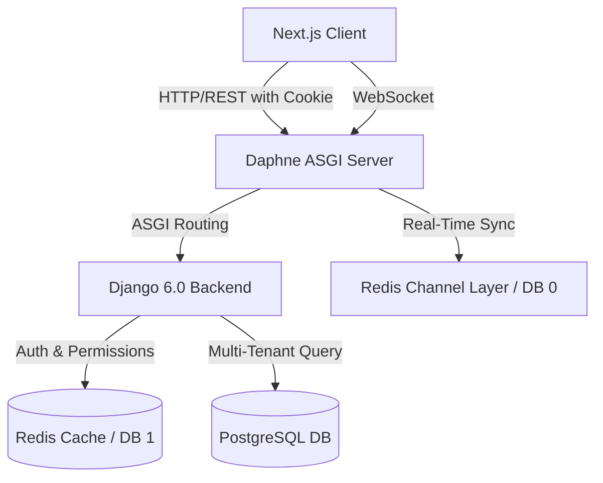
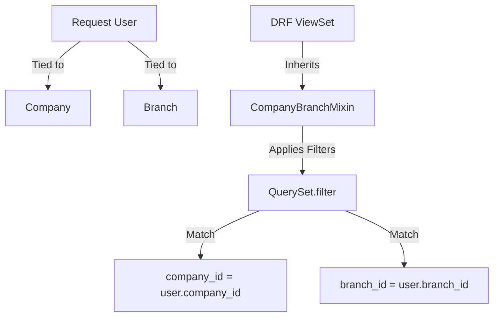
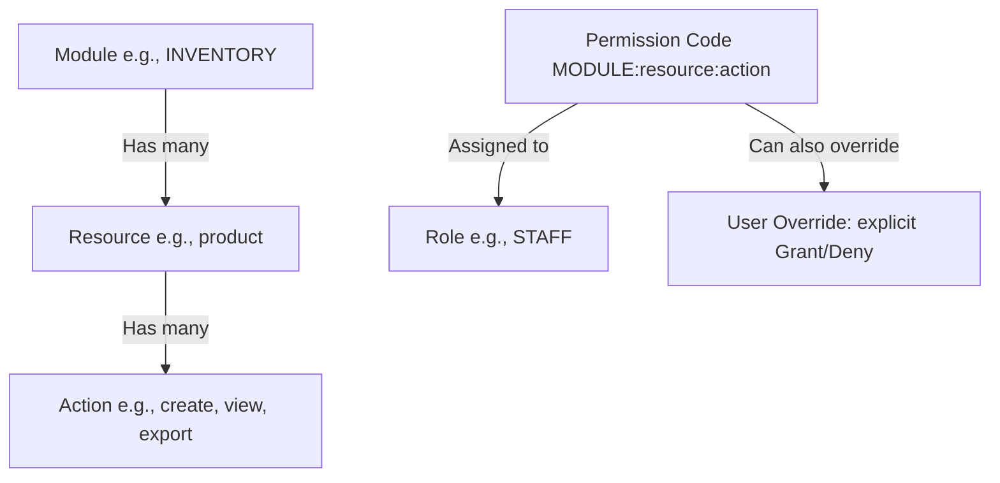
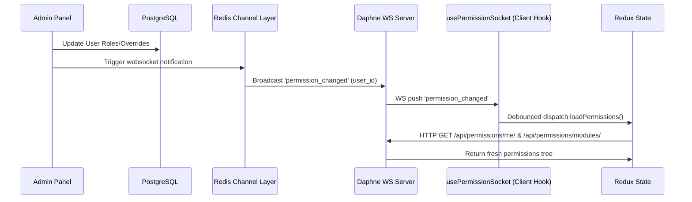

# Agent Context & System Architecture: Al-Qaiser ERP Hub

Welcome, Agent! This document acts as the single source of truth for the **Al-Qaiser ERP Hub** project. It provides an immediate overview of the system architecture, directory layouts, database schemas, and workflows to help you build, debug, and understand the codebase.

---

## 1. Project Overview & Architecture

Al-Qaiser ERP is a modular, multi-tenant Enterprise Resource Planning (ERP) application with a React-based Next.js frontend and a Python/Django backend. It is designed to manage business workflows across modules like HR, Inventory, Finance, and AI Monitoring, under a strict multi-tenant boundary.



### API URL Map
All API routes are registered in `backend/config/urls.py`:
| Prefix | App | Purpose |
|---|---|---|
| `/api/accounts/` | accounts | Auth (login, logout, refresh, me) |
| `/api/hr/` | hr | Employees, payroll, leave, shifts, assets, recruitment, policies, compensation, loans |
| `/api/inventory/` | inventory | Products, variants, stock, warehouses, purchases, sales, brands, categories, customers, suppliers, transfers, barcode, alerts, audit |
| `/api/finance/` | finance | Accounts, journal entries, payments, customer invoices, supplier bills, expenses, budgets, bank accounts, payroll, reports |
| `/api/organization/` | organization | Company, branch, user management |
| `/api/company/` | compsetting | Company settings, departments, designations |
| `/api/notifications/` | notifications | WebSocket notifications |
| `/api/permissions/` | permissions | RBAC (roles, permissions, modules) |
| `/api/sales/` | sales | Leads, quotes |
| `/api/forecast/` | forecast | Sales & stock forecasting |
| `/api/overall/` | overall_dashboard | Unified dashboard KPIs |
| `/api/audit/` | audit | Audit log viewer |

### Core Technologies
*   **Frontend**: Next.js 14+ (App Router), React, Redux Toolkit (global client state), TanStack Query (server cache/queries), Tailwind CSS, shadcn/ui.
*   **Backend**: Python, Django 6.0+, Django REST Framework (DRF), Django Channels 4.1 (WebSockets), Daphne (ASGI web server).
*   **Services**: PostgreSQL 15 (primary database), Redis 7 (caching, channel layer, and permission caching).
*   **Orchestration**: Docker Compose (services: `db`, `redis`, `backend`, `frontend`).

---

## 2. Multi-Tenancy & Data Isolation

Multi-tenancy is enforced at the database level using a shared-database, shared-schema pattern with tenant columns. Data is segregated using `company_id` and `branch_id`.



### Database Representation (`BaseModel`)
The abstract base model is defined in [basemodel.py](file:///home/devteam/Documents/Projects/alqaiser/backend/apps/common/basemodel.py):
*   `id`: Primary key (`BigIntegerField`).
*   `_id`: UUID4 for API exposure (to prevent numerical ID enumeration).
*   `company_id` / `branch_id`: Indexes for tenant segregation.
*   `is_deleted`: Soft-delete flag (records are never permanently deleted on standard actions).
*   `created_by`, `updated_by`, `deleted_by`: References to the custom `User` model, updated automatically via thread-local middleware context.

### DRF Data Isolation Mixin (`CompanyBranchMixin`)
Located in [baseauthentication.py](file:///home/devteam/Documents/Projects/alqaiser/backend/apps/common/baseauthentication.py):
*   Automatically filters every query by `company_id = request.user.company_id`.
*   Restricts access by `branch_id` unless the user holds the role of `COMPANY_ADMIN` (HQ level access).
*   Filters out soft-deleted records (`is_deleted=False`).

---

## 3. Cookie-Based JWT Authentication

Authentication is fully cookie-based. Standard JWT strings are hidden from frontend scripts to mitigate XSS risks.

*   **Login Flow**: Authenticates using [LoginView](file:///home/devteam/Documents/Projects/alqaiser/backend/apps/accounts/views.py#L56-L84). It issues two secure cookies:
    *   `access_token`: HttpOnly, Lax SameSite, short-lived.
    *   `refresh_token`: HttpOnly, Lax SameSite, long-lived.
*   **DRF Hook**: [CookieJWTAuthentication](file:///home/devteam/Documents/Projects/alqaiser/backend/apps/common/authentication.py) parses cookies from `request.COOKIES` to validate JWTs. It falls back to the `Authorization: Bearer <token>` header for developer environments (e.g. Swagger docs).
*   **Token Refreshing**: [CookieTokenRefreshView](file:///home/devteam/Documents/Projects/alqaiser/backend/apps/accounts/views.py#L104-L133) reads the `refresh_token` cookie and renews the `access_token` cookie.

---

## 4. Audit Logging System

The audit app (`apps/audit/`) provides generic, signal-based audit logging for all models with UUID `_id` fields.

### How It Works
- **`post_save` signal** (`audit_create_update`): Logs `CREATE` (all fields) and `UPDATE` (changed fields only) operations.
- **`pre_delete` signal** (`audit_delete`): Logs all field values before deletion.
- Skipped for: `AuditLog` itself, Django admin/auth/sessions/contenttypes models, and models without `_id` UUID.

### Database Models
- **`AuditLog`**: Stores `user`, `action` (CREATE/UPDATE/DELETE), `model_name`, `record_id` (UUID), `module` (app label), `ip_address`, `user_agent`. Inherits `BaseModel` for multi-tenant isolation.
- **`AuditLogChange`**: Stores individual field-level changes: `field_name`, `old_value`, `new_value`. FK to `AuditLog`.

### Key Details
- The `AuditLog` model overrides `created_by`/`updated_by`/`deleted_by` with custom `related_name` to avoid clashes with the auto-populated BaseModel fields.
- Audit signals require the `_request` attribute on model instances (set via thread-local middleware in middleware.py).
- Frontend route: `/inventory/audit` and `/finance/audit` provide dedicated audit log viewers.

---

## 5. Role-Based Access Control (RBAC) & Real-Time Sync

Al-Qaiser features a customized granular access control engine instead of standard Django Groups.



### The Permission String
A permission code is constructed as: `MODULE:resource:action`. E.g.:
*   `HR:employee:view`
*   `INVENTORY:product:create`
*   `FINANCE:account:delete`

### Database Models
Defined in [permissions/models.py](file:///home/devteam/Documents/Projects/alqaiser/backend/apps/permissions/models.py):
1.  **Module**: Top-level applications (HR, INVENTORY, FINANCE, etc.).
2.  **Resource**: Business domains inside a module (employee, product, stock, etc.).
3.  **Action**: Operations (`create`, `view`, `update`, `delete`, `export`, `approve`, `reject`, `assign`, `publish`, `archive`).
4.  **Permission**: Links Resource + Action with code `MODULE:resource:action`.
5.  **Role**: Groups permissions together. System default roles are `COMPANY_ADMIN` (gets `*`), `BRANCH_ADMIN`, and `STAFF`.
6.  **UserRole**: Many-to-many relationship mapping users to roles.
7.  **UserPermission**: User-specific permission overrides (can grant or deny explicitly). Exceeds role-based rules and supports an optional `expires_at` timestamp.

### Permission Caching & Resolution
Permissions are evaluated and cached in Redis with a configurable TTL (default 5 minutes). The resolution priority is:
1.  **Superuser / System Admin**: Bypass check (always `True`).
2.  **User Override**: Check `UserPermission`. If explicit grant or deny exists, return it immediately.
3.  **Role Hierarchy**: Batch fetch all user's roles and check if the permission is granted by any of them.

### Real-Time WebSocket Synchronization
To avoid lag when permissions are changed on the backend, a reactive pipeline is in place:



1.  **WS Server**: Daphne hosts `/ws/permissions/` mapped to `PermissionConsumer` in [permission_consumer.py](file:///home/devteam/Documents/Projects/alqaiser/backend/consumers/permission_consumer.py).
2.  **Client WS Hook**: [usePermissions.ts](file:///home/devteam/Documents/Projects/alqaiser/frontend/src/hooks/usePermissions.ts) listens to WS events.
3.  **Debounced Refresh**: Upon receiving a notification for the active user, it waits `300ms` (debouncing rapid changes) and dispatches `loadPermissions()`, updating the Redux store in real-time.

---

## 6. Codebase Directory Layout

### Backend Structure (`/backend`)
```
backend/
├── apps/                          # Django modular apps
│   ├── accounts/                  # Auth views (login, logout, refresh, me)
│   ├── audit/                     # Generic audit logging via signals (AuditLog, AuditLogChange)
│   ├── common/                    # Core abstract classes (BaseModel, CookieJWTAuthentication, CompanyBranchMixin)
│   ├── compsetting/               # Tenant company setup settings (CompanySettings, Department, Designation)
│   ├── finance/                   # Chart of accounts, journal entries, ledgers, payments, budgets, payroll
│   │   ├── models/                # account, bank, budget, customer_invoice, expense, journal, payment, supplier_bill
│   │   ├── serializers/           # Per-model serializers
│   │   ├── services/              # document, invoice_payment, payable
│   │   └── views/                 # Per-model viewsets
│   ├── forecast/                  # Sales & stock forecasting (models, services, tasks, analytics)
│   ├── hr/                        # Employee directories, shifts, attendance, leaves, payroll, compensation, loans, assets, recruitment, policies, exit mgmt
│   │   ├── serializers/           # asset, policy, recruitment, shift serializers
│   │   ├── services/              # assignment, shift services
│   │   └── views/                 # Per-feature viewsets (employee, leave, payroll, shift, asset, recruitment, policy, exit)
│   ├── inventory/                 # Products, variants, warehouses, stocks, transfers, PO/SO, brands, categories, customers, suppliers
│   │   ├── models/                # Per-model files (product, variant, stock, warehouse, purchase, sales, etc.)
│   │   ├── serializers/           # Per-model serializers
│   │   └── views/                 # Per-feature viewsets
│   ├── monitoring/                # AI logging & workforce dashboard metrics
│   ├── notifications/             # WebSocket notification consumer + models
│   ├── organization/              # Company, Branch, Custom User model + seed_org management command
│   ├── overall_dashboard/         # Unified KPIs (finance + inventory + sales)
│   ├── permissions/               # Custom RBAC (Module, Resource, Action, Permission, Role, UserRole, UserPermission) + seed_permissions
│   └── sales/                     # Leads, Quotes with customer conversion workflow

├── config/                        # Django project main config
│   ├── asgi.py                    # Daphne ASGI routing (HTTP + WebSockets)
│   ├── settings.py                # Main settings (SimpleJWT, CACHES, CHANNEL_LAYERS, CORS)
│   └── urls.py                    # Root URL router mapping to sub-apps
├── consumers/                     # Independent channel consumer logic (permission_consumer)
├── entrypoint.sh                  # Shell startup scripts (wait-for-db, Daphne run command)
├── requirements.txt               # Main python packages list
└── Dockerfile                     # Docker container config
```

### Frontend Structure (`/frontend`)
```
frontend/src/
├── app/                           # Next.js App Router folders
│   ├── (app)/                     # Authenticated layout group
│   │   ├── dashboard/             # Overall ERP dashboard page
│   │   ├── hr/                    # HR routes (employees, payroll, leave, attendance, shifts, assets, recruitment, compensation, exit, policies, performance)
│   │   ├── inventory/             # Inventory routes (dashboard, products, stock, warehouses, purchases, suppliers, transfers, barcode, reports, alerts, customers, pos, audit)
│   │   ├── sales/                 # Sales routes (dashboard, leads, quotes, customers, customer-invoices)
│   │   ├── finance/               # Finance routes (dashboard, accounts, expenses, budgets, bank-accounts, supplier-bills, payments, journal-entries, reports, payroll, taxes, audit, forecast)
│   │   ├── monitoring/            # AI Monitoring routes (dashboard, activity-tracking, inventory-monitoring, workforce-monitoring, alerts-events, reports-insights)
│   │   ├── settings/              # Settings routes (company, users, departments, designations, permissions, preferences)
│   │   └── page.tsx               # Root redirect → /dashboard
│   ├── login/                     # Simple username/password login page
│   ├── unauthorized/              # Standard access-denied route
│   └── layout.tsx / providers.tsx # Context wrap setup (Redux + React Query Providers)
├── components/                    # Sharable React/shadcn UI components
│   ├── payroll/                   # Payroll, Compensation, Loan forms/tables/modals
│   ├── leave/                     # Leave form modals
│   ├── finance/                   # Finance-specific (accounts, bank, budgets, etc.)
│   ├── inventory/                 # Inventory-specific (brand, category, product, warehouse, etc.)
│   ├── sales/                     # Sales-specific components
│   ├── settings/                  # Settings-specific (departments, designations)
│   ├── HRAssets/                  # HR asset management
│   ├── monitoring/                # Monitoring views
│   ├── recruitment/               # Recruitment components
│   ├── reuseable/                 # Reusable (StatsCards, SearchableSelect, etc.)
│   ├── cards/                     # Shared card components
│   ├── navbar/                    # Top navigation bar
│   ├── sidebar/                   # Sidebar navigation
│   └── ui/                        # shadcn/ui primitives
├── config/                        # Configuration mappings
│   └── routePermissions.ts        # Maps absolute routes to permission strings + menuPermissionMapping
├── contexts/                      # Shared context classes
│   └── NotificationContext.tsx     # WebSocket notification consumer + React Query cache invalidation
├── hooks/                         # Global React Hooks
│   ├── sales/                     # Sales hooks (useLeads, useQuotes, useSalesDashboard)
│   ├── finance/                   # Finance hooks (useAccounts, useExpenses, useBudgets, useBank, etc.)
│   ├── overall/                   # useOverallDashboard
│   ├── useAuth.ts                 # Accesses auth actions (login, logout)
│   ├── useApi.ts                  # Axios/fetch hook wrapper
│   ├── usePermissions.ts          # React query hooks + permissions WebSocket hook
│   ├── usePayroll.ts              # Payroll, Compensation, Loan hooks
│   ├── useEmployees.ts            # Employee hook
│   ├── useDepartments.ts          # Department hook
│   ├── useDesignations.ts         # Designation hook
│   ├── useLeaves.ts               # Leave hook
│   ├── ... (60+ hooks total)
├── layouts/                       # Layout components
│   └── AppLayout.tsx              # Main UI Shell. Watches route guards & company setup status
├── lib/                           # Utility scripts
│   └── api.ts                     # Core `apiFetch` wrapper mapping methods to toast notifications
├── store/                         # Redux Toolkit setup
│   ├── slices/                    # authSlice, permissionSlice, themeSlice, companySettingsSlice
│   └── index.ts                   # Store initialization export
├── types/                         # Shared typescript types definitions
└── styles.css                     # Global styles configuration
```

---

## 7. Key Developer Workflows

### Creating a New Backend API Model
When creating models, make sure to:
1.  Inherit from [BaseModel](file:///home/devteam/Documents/Projects/alqaiser/backend/apps/common/basemodel.py) to enable multi-tenant columns (`company_id`, `branch_id`), UUID lookup (`_id`), and soft deletes (`is_deleted`).
2.  Inherit your view from [CompanyBranchMixin](file:///home/devteam/Documents/Projects/alqaiser/backend/apps/common/baseauthentication.py) to automatically isolate records based on company.
3.  Inherit your view from [PermissionRequiredMixin](file:///home/devteam/Documents/Projects/alqaiser/backend/apps/permissions/mixins.py) to validate permissions, specifying:
    ```python
    permission_module = 'INVENTORY'
    permission_resource = 'brand'
    ```
4.  Audit logging is automatic via signals (no manual action needed) — models with `_id` UUID fields are tracked by `apps/audit/signals.py`.
5.  For real-time cache invalidation, send WebSocket `data_update` events from your views after mutations (see rule #4 above).

### Creating a New Django App
1. Create the app under `backend/apps/` with `python manage.py startapp <name> backend/apps/<name>`.
2. Add it to `INSTALLED_APPS` in `backend/config/settings.py`.
3. Register API routes in `backend/config/urls.py` under the `/api/` prefix.
4. Add Module/Resource/Action entries in `seed_permissions.py` for RBAC.
5. Create frontend route + permission mapping in `routePermissions.ts`.
6. Add entity-to-query-key mapping in `NotificationContext.tsx` for cache invalidation.

### Protecting a Frontend Next.js Route
1.  Create your page folder under `src/app/(app)/my-feature/page.tsx`.
2.  Add route mappings in [routePermissions.ts](file:///home/devteam/Documents/Projects/alqaiser/frontend/src/config/routePermissions.ts):
    ```typescript
    "/my-feature": "MODULE:resource:view"
    ```
3.  Add sidebar filters in `menuPermissionMapping` using the menu title to hide sidebar navigation dynamically if the user lacks access.
4.  For nested route groups (e.g. `/hr/compensation/[id]`), the `getRequiredPermission()` helper uses prefix matching — parent route permission covers nested paths.

### Adding Real-Time Cache Invalidation for a New Entity
1. Add entity name → query keys mapping in `NotificationContext.tsx` ENTITY_TO_QUERY_KEY:
   ```typescript
   my_entity: ["myEntity", "myEntityStats"]
   ```
2. From backend views, trigger WebSocket after mutations:
   ```python
   from channels.layers import get_channel_layer
   from asgiref.sync import async_to_sync
   channel_layer = get_channel_layer()
   async_to_sync(channel_layer.group_send)(
       f"notify_c{company_id}_b{branch_id}",
       {"type": "data_update", "entity": "my_entity", "action": "created", "record_id": obj._id}
   )
   ```

---

## 8. Initialization & Environment Seeding

### Seeding commands (Run inside the Django backend container)
Run the following commands inside `docker-compose exec backend <cmd>` to populate standard system data:

1.  **Seed Organization**: Setup company & default branch.
    ```bash
    python manage.py seed_org
    ```
    *(Uses variables from the backend's environment: `ORG_COMPANY_NAME`, `ORG_ADMIN_USERNAME`, `ORG_ADMIN_PASSWORD`)*
2.  **Seed Permissions Matrix**: Create all modules, resources, actions, permissions, and link system admin permissions.
    ```bash
    python manage.py seed_permissions
    ```
3.  **Seed Chart of Accounts**: Setup basic finance bookkeeping templates.
    ```bash
    python manage.py seed_chart_of_accounts --company-id=1 --branch-id=1
    ```

> **Order matters**: Run `seed_org` first (creates company + admin user), then `seed_permissions` (creates RBAC matrix), then `seed_chart_of_accounts` (creates finance templates).

### Management Commands Summary
| Command | Source | Description |
|---|---|---|
| `seed_org` | `apps/organization/management/commands/seed_org.py` | Creates company, default branch, and admin user |
| `seed_permissions` | `apps/permissions/management/commands/seed_permissions.py` | Seeds modules, resources, actions, permissions, roles |
| `seed_chart_of_accounts` | `apps/finance/management/commands/seed_chart_of_accounts.py` | Seeds finance COA templates |

### Docker Port Layout (Dev Environment)
*   **Host Port 3000**: Next.js App dev server.
*   **Host Port 8000**: Daphne ASGI backend server (serves REST endpoints under `/api/` and WS under `/ws/`).
*   **Host Port 5433**: PostgreSQL (mapped from container `5432`).
*   **Host Port 6379**: Redis (used for CACHES, WS Channel Layer, and permission cache store).

---

---

## 9. **AI AGENT RULES & GUIDELINES** (Copilot CLI, Gemini, and Other AI Assistants)

### Critical Restrictions
> [!IMPORTANT]
> **DO NOT** execute these commands under any circumstances:
> - `git commit`, `git push`, `git merge`, `git rebase`, or any git command
> - `python manage.py migrate`, `python manage.py makemigrations`, or any Django migration command
> - Any destructive database operations without explicit user confirmation

### Data & API Usage Rules

#### **1. Always Use Dynamic Data**
- **Never hardcode** static values, IDs, or test data in code.
- Fetch all data from the database/API at runtime using the backend endpoints.
- For dropdown lists, categories, or enums, use the API responses or query the database.
- Example: Instead of hardcoding `["draft", "published", "archived"]`, fetch statuses from the backend response or enum.

#### **2. Toast Notifications - Single Source of Truth**
- **ONLY** use the toast system defined in `@frontend/src/lib/api.ts` (`apiFetch` wrapper).
- **DO NOT** create alternative notification files (e.g., separate toast service, custom notification handler).
- The `apiFetch` function automatically shows:
  - ✅ **Success toast** for POST, PUT, PATCH, DELETE operations with `message` or `detail` in response.
  - ❌ **Error toast** for failed requests.
- All backend responses should include `message` or `detail` fields for user feedback.
- Example API response:
  ```json
  {
    "id": "uuid-123",
    "message": "Employee created successfully",
    "detail": "Employee John Doe added to the system"
  }
  ```

#### **3. WebSocket Integration & Real-Time Updates**
- Use WebSocket for real-time data synchronization and notifications.
- **Notification WebSocket** (`/ws/notifications/{company_id}/{branch_id}/`):
  - Handles real-time notifications pushed to users.
  - Managed by `NotificationProvider` in `@frontend/src/contexts/NotificationContext.tsx`.
  - Emits `type: "notification"` events for user alerts.
  - Emits `type: "data_update"` events for cache invalidation (entity name and action).
  
- **Permission WebSocket** (`/ws/permissions/`):
  - Pushes permission changes in real-time via `permission_changed` event.
  - Triggers Redux state update in `usePermissions.ts` hook.
  - Debounced to avoid spam (300ms delay).

- **Backend Consumer Pattern** (in `/backend/consumers/`):
  ```python
  class NotificationConsumer(AsyncWebsocketConsumer):
      async def connect(self):
          await self.channel_layer.group_add(...)
          await self.accept()
      
      async def notify_event(self, event):
          await self.send(text_data=json.dumps(event))
  ```

- **Frontend Hook Pattern** (React Query cache invalidation):
  ```typescript
  const [notifications, setNotifications] = useState([]);
  const queryClient = useQueryClient();
  
  // On WebSocket message:
  if (data.type === "data_update") {
    const { entity, action } = data;
    queryClient.invalidateQueries({ queryKey: [entity] }); // Refetch data
  }
  ```

#### **4. Update NotificationContext & Trigger Cache Refresh**
When implementing data mutations or real-time features:
- Trigger WebSocket events that emit `type: "data_update"` with entity name.
- The `NotificationContext` will automatically invalidate React Query caches via `ENTITY_TO_QUERY_KEY` mapping.
- Current entity-to-query-key mappings in `@frontend/src/contexts/NotificationContext.tsx`:

| Backend Entity | React Query Keys Invalidated |
|---|---|
| `employees` | `employees`, `employeeStats` |
| `leaves` | `leaves`, `leaveStats`, `leaveBalances` |
| `payroll` | `payroll`, `payrollStats` |
| `compensations` | `compensations` |
| `loans` | `loans`, `employeeLoans` |
| `inventory_product` | `inventory_product` |
| `inventory_variant` | `inventory_variant`, `batchStock` |
| `inventory_stock` | `inventory_stock`, `batchStock` |
| `inventory_sales_order` | `inventory_sales_order` |
| `finance_customer_invoice` | `finance_customer_invoice` |
| ... | (full list in file) |

- Example backend trigger:
  ```python
  from asgiref.sync import async_to_sync
  from channels.layers import get_channel_layer
  
  channel_layer = get_channel_layer()
  async_to_sync(channel_layer.group_send)(
      f"notify_c{company_id}_b{branch_id}",
      {
          "type": "data_update",
          "entity": "inventory_product",
          "action": "created",
          "record_id": product._id
      }
  )
  ```

#### **5. Multi-Tenant Data Isolation**
- **Always** query by `company_id` and `branch_id` from `request.user`.
- Use `CompanyBranchMixin` in DRF ViewSets to auto-filter queries.
- Use `_id` (UUID) for API lookups, NOT `id` (auto-increment).
- Never expose raw `id` fields in API responses (security risk - ID enumeration).
- All model serializers should expose `_id` as the identifier.

#### **6. Permission Checks & RBAC**
- Use `PermissionRequiredMixin` on backend ViewSets with module/resource/action.
- Frontend: Check permissions via Redux slice (`state.permissions.modules`).
- Use `usePermissions()` hook to sync permission changes with WebSocket.
- Implement route guards on protected pages using `routePermissions.ts` mapping.

#### **7. API Response Structure**
All backend API responses should follow this pattern:
```json
{
  "id": "UUID (exposed as _id in serializers)",
  "message": "Human-readable success/status message",
  "detail": "Optional detailed description",
  "data": { /* main response body */ },
  "errors": { /* field-level validation errors (POST/PUT/PATCH) */ }
}
```

#### **8. React Query & TanStack Query**
- Leverage React Query hooks in `/frontend/src/hooks/` for server-state management.
- All hooks use `apiFetch` internally (already integrated with toast).
- Cache keys follow pattern: `[entity, entityId]` or `[entity, "stats"]`.
- Use `invalidateQueries` when mutations succeed.
- Example hook pattern:
  ```typescript
  export function useProducts() {
    return useQuery({
      queryKey: ["inventory_product"],
      queryFn: () => api("/api/inventory/products/", { method: "GET" })
    });
  }
  ```

#### **9. Backend Serializers & Responses**
- Always inherit from `DRF Serializers` (or model serializers).
- Include `_id` (UUID) field in serializers for API exposure.
- Add `message`/`detail` fields in `create()`, `update()`, `destroy()` methods.
- Use `CompanyBranchMixin` + `PermissionRequiredMixin` on ViewSets.
- Example:
  ```python
  class ProductViewSet(viewsets.ModelViewSet, CompanyBranchMixin, PermissionRequiredMixin):
      permission_module = 'INVENTORY'
      permission_resource = 'product'
      queryset = Product.objects.all()
      serializer_class = ProductSerializer
      
      def perform_create(self, serializer):
          serializer.save(created_by=self.request.user)
  ```

#### **10. Frontend Component Patterns**
- Use hooks from `/frontend/src/hooks/` for data fetching.
- Call `apiFetch` via `useApi()` hook for mutations.
- Handle loading/error states with React Query.
- Example form submission:
  ```typescript
  const api = useApi();
  const { mutate: createProduct } = useMutation({
    mutationFn: (data) => api("/api/inventory/products/", { 
      method: "POST", 
      body: JSON.stringify(data) 
    }),
    onSuccess: () => {
      queryClient.invalidateQueries({ queryKey: ["inventory_product"] });
    }
  });
  ```

#### **11. Environment & Configuration**
- Never commit `.env` files or secrets.
- Use `NEXT_PUBLIC_*` prefix only for client-safe values in frontend.
- Backend environment variables are injected via Docker Compose.
- Frontend API URL: `process.env.NEXT_PUBLIC_API_URL` (e.g., `http://localhost:8000`).

#### **12. When NOT to Use apiFetch Directly**
Do **NOT** bypass `apiFetch` in these cases:
- File uploads (use multipart form data with special handling).
- WebSocket connections (use dedicated consumer classes).
- Streaming responses (use native fetch with streaming).
- For these, wrap the response in toast notifications manually if needed.

#### **13. Inline "Add New" Pattern for Dropdowns**
When a form contains a dropdown/select for a related entity (e.g., Department or Designation), allow users to create that entity inline without leaving the form:

- **`SearchableSelect`** supports `onAddNew` and `addNewLabel` props (defined in `frontend/src/components/reuseable/SearchableSelect.tsx`). When provided, an "+ Add New" item renders at the bottom of the dropdown list.
- Clicking "+ Add New" opens a small overlay modal (the entity's creation form) on top of the parent form.
- The **parent form stays open** and **all filled fields are preserved** — the sub-modal is a separate overlay (`fixed z-50`) that renders above it.
- After the sub-modal successfully creates the record, call `refetch()` on the parent's data hook so the new option appears in the dropdown.
- Examples in the codebase:
  - `EmployeeForm.jsx` — Department and Designation dropdowns have `onAddNew` opening `DepartmentFormModal` / `DesignationFormModal`.
  - `UserForm.tsx` — Same pattern for both dropdowns.
  - `DesignationFormModal.tsx` — Department label has a "+ Add New" button (native `<select>`, not `SearchableSelect`) opening `DepartmentFormModal`.
- Do NOT add separate "New Department" / "New Designation" buttons at the page header level. Keep the creation entry point inside the relevant dropdown.

#### **14. Leave Form Date Validation (Frontend & Backend)**
When implementing or updating Leave forms and APIs, enforce the following rules to prevent invalid date ranges and incorrect leave applications:

- Frontend: The leave period picker must prevent or validate selection where the end date is before the start date. Forms should show a clear error (e.g., "End date cannot be before start date") and block submission until corrected. Use the shared DateRangePicker components and validate onChange and before submit.
- Backend: The leave creation/update endpoints must validate that the employee's joining_date is strictly before the leave start_date. If the employee has not joined before the requested leave starts, return HTTP 400 with a descriptive error message (e.g., "Employee must have joined before the leave start date").
- Rationale: Prevents applying leave for periods that are chronologically invalid or before employment begins. Keep validation on both client and server for UX and security.

---

---

> [!IMPORTANT]
> Always verify that your model queries fetch using `_id` (UUID) in the API views instead of `id` (bigint auto-increment) to comply with lookup configurations.
> **AI agents MUST NOT:**
> - Run any git, migration, or destructive database commands
> - Use static/hardcoded data
> - Create alternative notification systems (use `apiFetch` + `NotificationContext`)
> - Expose `id` fields in API responses (use `_id` only)

---

> [!IMPORTANT]
> **ALWAYS USE PURE POSTGRESQL RELATIONAL DB FORMAT**
> - Use proper relational database design patterns with PostgreSQL
> - Define explicit foreign key relationships between models
> - Use appropriate data types (e.g., `DecimalField` for money, `PositiveSmallIntegerField` for months/years)
> - Create database indexes for frequently queried columns
- Use `unique_together` constraints where needed for data integrity
> - Follow PostgreSQL naming conventions (snake_case for tables and columns)
> - Use `JSONField` only for truly unstructured data; prefer normalized tables for relational data
> - Always use `on_delete` behavior explicitly (CASCADE, SET_NULL, etc.)

---

## 10. Compensation & Loan Module - IMPLEMENTED

### Compensation Module Changes (Implemented)

#### Fields REMOVED from `Compensation` model:
- `grade` (CharField) - Removed
- `effective_date` (DateField) - Removed

#### New Child Tables (Implemented):
- `CompensationSelectedMonth` - Stores multiple selected months for SELECTED_MONTH frequency
- `CompensationMonthRange` - Stores start/end range for MONTH_RANGE frequency (OneToOne with Compensation)

#### Frequency Type Behavior:
- **SELECTED_MONTH**: Multi-select month picker with checkboxes. User can select multiple months.
- **MONTH_RANGE**: Start/end month+year dropdowns with validation:
  - End month/year must not be before start month/year
  - Start month/year must not be before employee's joining_date
  - Months before employee joining date are filtered out from dropdowns

---

### Loan Module Changes (Implemented)

#### Fields REMOVED from `EmployeeLoan` model:
- `monthly_deduction` (DecimalField) - Removed (now in child tables)
- `total_months` (PositiveIntegerField) - Removed
- `start_date` (DateField) - Removed

#### New Child Tables (Implemented):
- `LoanSelectedMonth` - Stores multiple selected months + deduction for SELECTED_MONTH frequency
  - `deduction` field: Auto-calculated (total_payable / num_months), EDITABLE by user
- `LoanMonthRange` - Stores start/end range + deduction for MONTH_RANGE frequency
  - `deduction` field: Auto-calculated (total_payable / total_months), NOT editable

#### Frequency Type Behavior:
- **SELECTED_MONTH**: Multi-select month picker + per-month deduction fields (auto-calculated, editable)
- **MONTH_RANGE**: Start/end month+year dropdowns + deduction display (auto-calculated, read-only)
- Same validation rules as compensation (end >= start, start >= joining_date)

---

### Files Modified

#### Backend:
- `backend/apps/hr/models.py` - Removed fields, added 4 new child models (CompensationSelectedMonth, CompensationMonthRange, LoanSelectedMonth, LoanMonthRange)
- `backend/apps/hr/views/payroll_views.py` - Major refactor (463 lines changed), updated serializers, CRUD operations, validation
- `backend/apps/hr/urls.py` - Added routes for compensation detail and loan detail
- `backend/apps/hr/migrations/0005-0007` - Compensation/Loan migration changes, fuel_allowance removal

#### Frontend:
- `frontend/src/components/payroll/types.ts` - New interfaces (SelectedMonth, MonthRange), helper functions
- `frontend/src/components/payroll/CompensationForm.tsx` - Removed grade/effective_date, multi-select UI, validation
- `frontend/src/components/payroll/LoanForm.tsx` - Removed monthly_deduction/total_months/start_date, deduction fields
- `frontend/src/components/payroll/CompensationTab.tsx` - Removed Grade/Effective Date columns
- `frontend/src/components/payroll/LoanTab.tsx` - Updated display (removed Monthly column, shows Total Payable)
- `frontend/src/components/payroll/CompensationLoanPage.tsx` - Refactored with employee joining date, tab-based UI
- `frontend/src/hooks/usePayroll.ts` - Updated interfaces, new hooks (useCompensation, useEmployeeLoan, useUpdateLoanStatus, usePayrollPreview)
- `frontend/src/app/(app)/hr/compensation/[id]/page.tsx` - **NEW**: Compensation detail page with allowances breakdown, CTC summary
- `frontend/src/app/(app)/hr/compensation/loan/[id]/page.tsx` - **NEW**: Loan detail page with repayment progress, monthly deductions

### API Response Structure

#### Compensation Response:
```json
{
  "id": "uuid",
  "employee_id": "uuid",
  "frequency_type": "SELECTED_MONTH",
  "selected_months": [{"month": 1, "year": 2025}, ...],
  "month_range": {"start_month": 1, "start_year": 2025, "end_month": 12, "end_year": 2025}
}
```

#### Loan Response:
```json
{
  "id": "uuid",
  "employee_id": "uuid",
  "frequency_type": "MONTH_RANGE",
  "selected_months": [{"month": 1, "year": 2025, "deduction": "5000.00"}, ...],
  "month_range": {"start_month": 1, "start_year": 2025, "end_month": 12, "end_year": 2025, "deduction": "5000.00"}
}
```