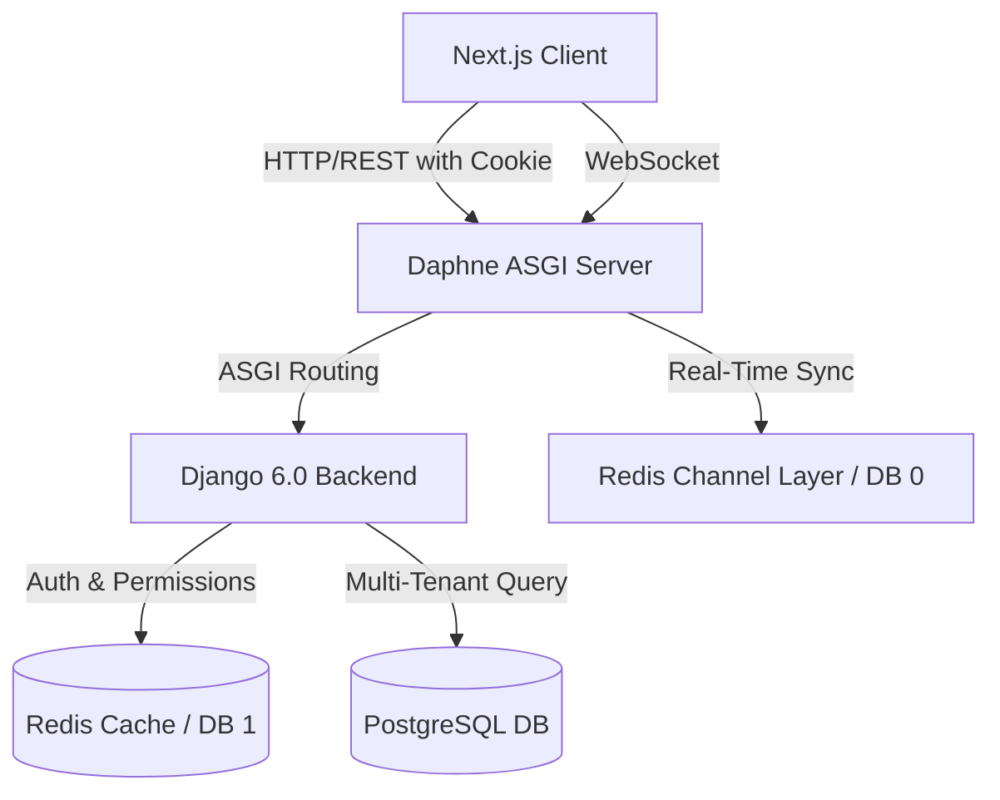
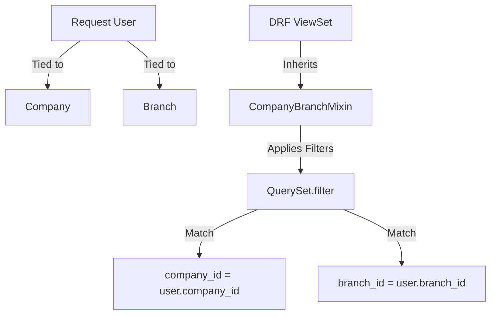
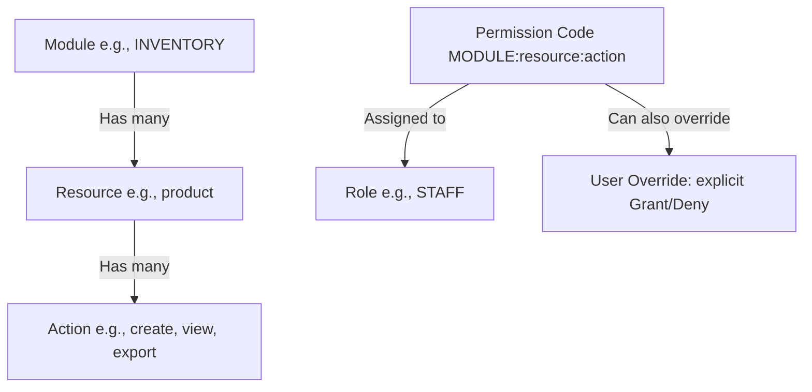
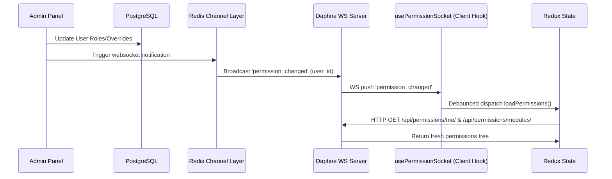

# Agent Context & System Architecture: Al-Qaiser ERP Hub

Welcome, Agent! This document acts as the single source of truth for the **Al-Qaiser ERP Hub** project. It provides an immediate overview of the system architecture, directory layouts, database schemas, and workflows to help you build, debug, and understand the codebase.

---

## 1. Project Overview & Architecture

Al-Qaiser ERP is a modular, multi-tenant Enterprise Resource Planning (ERP) application with a React-based Next.js frontend and a Python/Django backend. It is designed to manage business workflows across modules like HR, Inventory, Finance, and AI Monitoring, under a strict multi-tenant boundary.



### Core Technologies
*   **Frontend**: Next.js 14+ (App Router), React, Redux Toolkit (global client state), TanStack Query (server cache/queries), Tailwind CSS, shadcn/ui.
*   **Backend**: Python, Django 6.0+, Django REST Framework (DRF), Django Channels 4.1 (WebSockets), Daphne (ASGI web server).
*   **Services**: PostgreSQL 15 (primary database), Redis 7 (caching, channel layer, and permission caching).
*   **Orchestration**: Docker Compose (services: `db`, `redis`, `backend`, `frontend`).

---

## 2. Multi-Tenancy & Data Isolation

Multi-tenancy is enforced at the database level using a shared-database, shared-schema pattern with tenant columns. Data is segregated using `company_id` and `branch_id`.



### Database Representation (`BaseModel`)
The abstract base model is defined in [basemodel.py](file:///home/devteam/Documents/Projects/alqaiser/backend/apps/common/basemodel.py):
*   `id`: Primary key (`BigIntegerField`).
*   `_id`: UUID4 for API exposure (to prevent numerical ID enumeration).
*   `company_id` / `branch_id`: Indexes for tenant segregation.
*   `is_deleted`: Soft-delete flag (records are never permanently deleted on standard actions).
*   `created_by`, `updated_by`, `deleted_by`: References to the custom `User` model, updated automatically via thread-local middleware context.

### DRF Data Isolation Mixin (`CompanyBranchMixin`)
Located in [baseauthentication.py](file:///home/devteam/Documents/Projects/alqaiser/backend/apps/common/baseauthentication.py):
*   Automatically filters every query by `company_id = request.user.company_id`.
*   Restricts access by `branch_id` unless the user holds the role of `COMPANY_ADMIN` (HQ level access).
*   Filters out soft-deleted records (`is_deleted=False`).

---

## 3. Cookie-Based JWT Authentication

Authentication is fully cookie-based. Standard JWT strings are hidden from frontend scripts to mitigate XSS risks.

*   **Login Flow**: Authenticates using [LoginView](file:///home/devteam/Documents/Projects/alqaiser/backend/apps/accounts/views.py#L56-L84). It issues two secure cookies:
    *   `access_token`: HttpOnly, Lax SameSite, short-lived.
    *   `refresh_token`: HttpOnly, Lax SameSite, long-lived.
*   **DRF Hook**: [CookieJWTAuthentication](file:///home/devteam/Documents/Projects/alqaiser/backend/apps/common/authentication.py) parses cookies from `request.COOKIES` to validate JWTs. It falls back to the `Authorization: Bearer <token>` header for developer environments (e.g. Swagger docs).
*   **Token Refreshing**: [CookieTokenRefreshView](file:///home/devteam/Documents/Projects/alqaiser/backend/apps/accounts/views.py#L104-L133) reads the `refresh_token` cookie and renews the `access_token` cookie.

---

## 4. Role-Based Access Control (RBAC) & Real-Time Sync

Al-Qaiser features a customized granular access control engine instead of standard Django Groups.



### The Permission String
A permission code is constructed as: `MODULE:resource:action`. E.g.:
*   `HR:employee:view`
*   `INVENTORY:product:create`
*   `FINANCE:account:delete`

### Database Models
Defined in [permissions/models.py](file:///home/devteam/Documents/Projects/alqaiser/backend/apps/permissions/models.py):
1.  **Module**: Top-level applications (HR, INVENTORY, FINANCE, etc.).
2.  **Resource**: Business domains inside a module (employee, product, stock, etc.).
3.  **Action**: Operations (`create`, `view`, `update`, `delete`, `export`, `approve`, `reject`, `assign`, `publish`, `archive`).
4.  **Permission**: Links Resource + Action with code `MODULE:resource:action`.
5.  **Role**: Groups permissions together. System default roles are `COMPANY_ADMIN` (gets `*`), `BRANCH_ADMIN`, and `STAFF`.
6.  **UserRole**: Many-to-many relationship mapping users to roles.
7.  **UserPermission**: User-specific permission overrides (can grant or deny explicitly). Exceeds role-based rules and supports an optional `expires_at` timestamp.

### Permission Caching & Resolution
Permissions are evaluated and cached in Redis with a configurable TTL (default 5 minutes). The resolution priority is:
1.  **Superuser / System Admin**: Bypass check (always `True`).
2.  **User Override**: Check `UserPermission`. If explicit grant or deny exists, return it immediately.
3.  **Role Hierarchy**: Batch fetch all user's roles and check if the permission is granted by any of them.

### Real-Time WebSocket Synchronization
To avoid lag when permissions are changed on the backend, a reactive pipeline is in place:



1.  **WS Server**: Daphne hosts `/ws/permissions/` mapped to `PermissionConsumer` in [permission_consumer.py](file:///home/devteam/Documents/Projects/alqaiser/backend/consumers/permission_consumer.py).
2.  **Client WS Hook**: [usePermissions.ts](file:///home/devteam/Documents/Projects/alqaiser/frontend/src/hooks/usePermissions.ts) listens to WS events.
3.  **Debounced Refresh**: Upon receiving a notification for the active user, it waits `300ms` (debouncing rapid changes) and dispatches `loadPermissions()`, updating the Redux store in real-time.

---

## 5. Codebase Directory Layout

### Backend Structure (`/backend`)
```
backend/
├── apps/                          # Django modular apps
│   ├── accounts/                  # Auth views (login, logout, refresh, me)
│   ├── common/                    # Core abstract classes (BaseModel, CookieJWTAuthentication, CompanyBranchMixin)
│   ├── compsetting/               # Tenant company setup settings
│   ├── finance/                   # Chart of accounts, journal entries, ledgers
│   ├── hr/                        # Employee directories, shifts, attendance, leaves
│   ├── inventory/                 # Product variants, warehouses, stocks, transfers, PO/SO
│   ├── monitoring/                # AI logging & workforce dashboard metrics
│   ├── notifications/             # WebSockets middleware & notification consumers
│   ├── organization/              # Company, Branch, and Custom User model schemas
│   ├── permissions/               # Custom RBAC database models, views, and helpers
└───sales/                     # Leads (title/source), Quotes, and Sales workflows

├── config/                        # Django project main config

│   ├── asgi.py                    # Daphne ASGI routing (HTTP + WebSockets)
│   ├── settings.py                # Main settings (SimpleJWT, CACHES, CHANNEL_LAYERS, CORS)
│   └── urls.py                    # Root URL router mapping to sub-apps
├── consumers/                     # Independent channel consumer logic
├── entrypoint.sh                  # Shell startup scripts (wait-for-db, Daphne run command)
├── requirements.txt               # Main python packages list
└── Dockerfile                     # Docker container config
```

### Frontend Structure (`/frontend`)
```
frontend/src/
├── app/                           # Next.js App Router folders
│   ├── (app)/                     # Authenticated layout group (dashboard, inventory, hr, settings, finance)
│   ├── login/                     # Simple username/password login page
│   ├── unauthorized/              # Standard access-denied route
│   └── layout.tsx / providers.tsx # Context wrap setup (Redux + React Query Providers)
├── components/                    # Sharable React/shadcn UI components
├── config/                        # Configuration mappings
│   └── routePermissions.ts        # Maps absolute routes to permission strings
├── contexts/                      # Shared context classes
├── hooks/                         # Global React Hooks
│   ├── sales/                     # Sales hooks (useLeads, useQuotes)
│   ├── finance/                   # Finance hooks
│   ├── useAuth.ts                 # Accesses auth actions (login, logout)
│   ├── useApi.ts                  # Axios/fetch hook wrapper
│   └── usePermissions.ts          # React query hooks + permissions WebSocket hook
├── layouts/                       # Layout components
│   └── AppLayout.tsx              # Main UI Shell. Watches route guards & company setup status
├── lib/                           # Utility scripts
│   └── api.ts                     # Core `apiFetch` wrapper mapping methods to toast notifications
├── store/                         # Redux Toolkit setup
│   ├── slices/                    # Slices (authSlice, permissionSlice, themeSlice)
│   └── index.ts                   # Store initialization export
├── types/                         # Shared typescript types definitions
└── styles.css                     # Global styles configuration
```

---

## 6. Key Developer Workflows

### Creating a New Backend API Model
When creating models, make sure to:
1.  Inherit from [BaseModel](file:///home/devteam/Documents/Projects/alqaiser/backend/apps/common/basemodel.py) to enable multi-tenant columns (`company_id`, `branch_id`), UUID lookup (`_id`), and soft deletes (`is_deleted`).
2.  Inherit your view from [CompanyBranchMixin](file:///home/devteam/Documents/Projects/alqaiser/backend/apps/common/baseauthentication.py) to automatically isolate records based on company.
3.  Inherit your view from [PermissionRequiredMixin](file:///home/devteam/Documents/Projects/alqaiser/backend/apps/permissions/mixins.py) to validate permissions, specifying:
    ```python
    permission_module = 'INVENTORY'
    permission_resource = 'brand'
    ```

### Protecting a Frontend Next.js Route
1.  Create your page folder under `src/app/(app)/my-feature/page.tsx`.
2.  Add route mappings in [routePermissions.ts](file:///home/devteam/Documents/Projects/alqaiser/frontend/src/config/routePermissions.ts):
    ```typescript
    "/my-feature": "MODULE:resource:view"
    ```
3.  Add sidebar filters in `menuPermissionMapping` using the menu title to hide sidebar navigation dynamically if the user lacks access.

---

## 7. Initialization & Environment Seeding

### Seeding commands (Run inside the Django backend container)
Run the following commands inside `docker-compose exec backend <cmd>` to populate standard system data:

1.  **Seed Organization**: Setup company & default branch.
    ```bash
    python manage.py seed_org
    ```
    *(Uses variables from the backend's environment: `ORG_COMPANY_NAME`, `ORG_ADMIN_USERNAME`, `ORG_ADMIN_PASSWORD`)*
2.  **Seed Permissions Matrix**: Create all modules, resources, actions, permissions, and link system admin permissions.
    ```bash
    python manage.py seed_permissions
    ```
3.  **Seed Chart of Accounts**: Setup basic finance bookkeeping templates.
    ```bash
    python manage.py seed_chart_of_accounts --company-id=1 --branch-id=1
    ```

### Docker Port Layout (Dev Environment)
*   **Host Port 3000**: Next.js App dev server.
*   **Host Port 8000**: Daphne ASGI backend server (serves REST endpoints under `/api/` and WS under `/ws/`).
*   **Host Port 5433**: PostgreSQL (mapped from container `5432`).
*   **Host Port 6379**: Redis (used for CACHES, WS Channel Layer, and permission cache store).

---

> [!IMPORTANT]
> Always verify that your model queries fetch using `_id` (UUID) in the API views instead of `id` (bigint auto-increment) to comply with lookup configurations.
